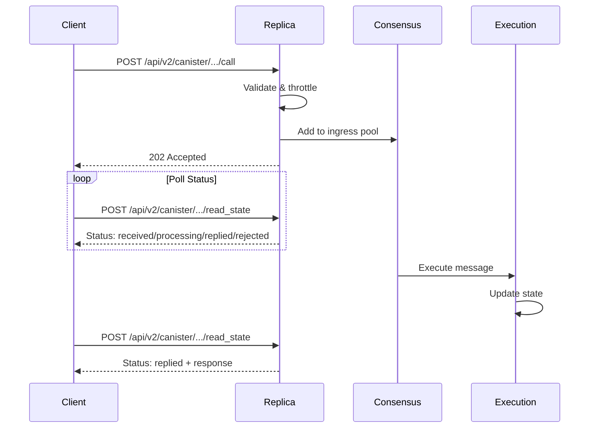
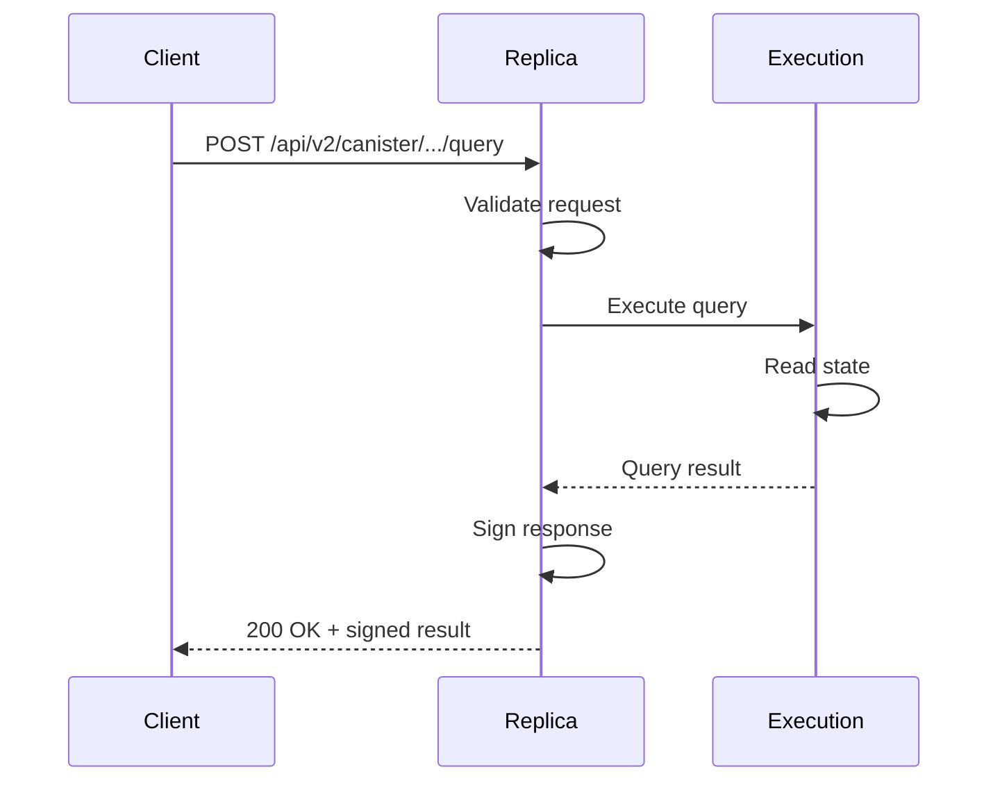

## Overview

The HTTP endpoints component provides all HTTP(S) server interfaces for the Internet Computer. These endpoints handle external client requests, internal metrics collection, and administrative operations.

**Location**: `rs/http_endpoints/`

<CardGroup cols={2}>
  <Card title="Public API" icon="globe" href="#public-https-api">
    User-facing HTTPS endpoints for canister calls
  </Card>
  <Card title="Metrics" icon="chart-line" href="#metrics-endpoint">
    Prometheus-compatible metrics endpoint
  </Card>
</CardGroup>

## Architecture

The HTTP endpoints follow best practices for reliability and security:

### Design Principles

<AccordionGroup>
  <Accordion title="Connection Management">
    **Nftables Integration**
    
    ReplicaOS uses nftables for:
    - Restrict inbound traffic to registry-approved IPs
    - Limit simultaneous TCP connections per source IP
    - Rate limit connection establishment
    
    **Idle Connection Detection**
    
    Connections are dropped after `connection_read_timeout_seconds` with no activity to prevent:
    - Resource exhaustion
    - File descriptor leaks
    - Hung connections
  </Accordion>

  <Accordion title="Queue Management">
    Uses the **thread-per-request pattern**:
    
    - Requests sit in bounded-size queue
    - Thread pool processes requests from queue
    - Cancelled requests are not executed
    - Non-blocking async runtime using threadpools and oneshot channels
  </Accordion>

  <Accordion title="Load Shedding">
    Fail early and cheaply when overloaded:
    
    - Return `429 Too Many Requests` when queues are full
    - Benefits load balancers using least-loaded round robin
    - Prevents cascading failures
  </Accordion>

  <Accordion title="Request Timeout">
    Guard against stuck upstream services:
    
    - Each request has a timeout
    - Return `504 Gateway Timeout` if not completed
    - Prevents connection drops on slow operations
  </Accordion>
</AccordionGroup>

## Public HTTPS API

### Overview

Implements the [HTTPS Interface](https://internetcomputer.org/docs/current/references/ic-interface-spec#http-interface) defined by the Internet Computer Interface Specification.

**Location**: `rs/http_endpoints/public/`

### Endpoint Versions

The API supports multiple versions:

- **v2**: Original API with flat canister ranges format
- **v3**: API with tree-based canister ranges format
- **v4**: Latest version with enhanced features (call endpoint)

### Core Endpoints

#### Call Endpoint

Submit ingress messages to canisters.

**Paths**:
- `/api/v2/canister/{effective_canister_id}/call`
- `/api/v3/canister/{effective_canister_id}/call`
- `/api/v4/canister/{effective_canister_id}/call`

**Request Format**:
```rust
pub struct HttpRequestEnvelope<T> {
    pub content: T,
    pub sender_pubkey: Option<Vec<u8>>,
    pub sender_sig: Option<Vec<u8>>,
    pub sender_delegation: Option<Vec<Delegation>>,
}

pub struct HttpCallContent {
    pub canister_id: CanisterId,
    pub method_name: String,
    pub arg: Vec<u8>,
    pub nonce: Option<Vec<u8>>,
    pub ingress_expiry: u64,
    pub sender: PrincipalId,
}
```

**Processing Pipeline**:

1. **Validation**: Verify signature and delegation chain
2. **Ingress Filter**: Check if canister accepts the call
3. **Throttling**: Apply rate limits and pool throttling
4. **Submission**: Add to ingress pool for processing

**Response Codes**:
- `202 Accepted`: Message accepted for processing
- `400 Bad Request`: Malformed request
- `413 Payload Too Large`: Request exceeds size limit
- `429 Too Many Requests`: Ingress pool is full
- `500 Internal Server Error`: Internal processing error

<Warning>
Ingress messages are not executed synchronously. Use the read_state endpoint to check execution status.
</Warning>

#### Query Endpoint

Execute read-only queries against canisters.

**Paths**:
- `/api/v2/canister/{effective_canister_id}/query`
- `/api/v3/canister/{effective_canister_id}/query`

**Request Format**:
```rust
pub struct HttpQueryContent {
    pub canister_id: CanisterId,
    pub method_name: String,
    pub arg: Vec<u8>,
    pub sender: PrincipalId,
    pub nonce: Option<Vec<u8>>,
    pub ingress_expiry: u64,
}
```

**Response Format**:
```rust
pub struct HttpQueryResponse {
    pub status: String,  // "replied" or "rejected"
    pub reply: Option<HttpQueryResponseReply>,
    pub reject_code: Option<RejectCode>,
    pub reject_message: Option<String>,
    pub signatures: Vec<NodeSignature>,
}
```

**Key Features**:
- Synchronous execution and response
- Signed responses for verification
- Support for delegated query calls
- Health status checks before execution

#### Read State Endpoint

Read certified state information from the IC.

**Canister Read State**:
- `/api/v2/canister/{effective_canister_id}/read_state`
- `/api/v3/canister/{effective_canister_id}/read_state`

**Subnet Read State**:
- `/api/v2/subnet/{effective_subnet_id}/read_state`
- `/api/v3/subnet/{effective_subnet_id}/read_state`

**Request Format**:
```rust
pub struct HttpReadStateContent {
    pub paths: Vec<Path>,
    pub ingress_expiry: u64,
    pub sender: PrincipalId,
    pub nonce: Option<Vec<u8>>,
}
```

**Response Format**:
```rust
pub struct HttpReadStateResponse {
    pub certificate: Certificate,
}

pub struct Certificate {
    pub tree: LabeledTree<Vec<u8>>,
    pub signature: Vec<u8>,
    pub delegation: Option<CertificateDelegation>,
}
```

**Readable Paths**:
- `/time`: Current certified time
- `/request_status/<request_id>`: Ingress message status
- `/canister/<canister_id>/module_hash`: Canister wasm hash
- `/canister/<canister_id>/controllers`: Canister controllers
- `/canister/<canister_id>/metadata/<name>`: Canister metadata
- `/subnet/<subnet_id>/public_key`: Subnet public key
- `/subnet/<subnet_id>/canister_ranges`: Canister ID ranges

<Info>
All read_state responses include cryptographic certificates that can be verified against the IC root key.
</Info>

### Ingress Validation

The ingress validation pipeline ensures message integrity:

```rust
pub struct IngressValidator {
    log: ReplicaLogger,
    node_id: NodeId,
    subnet_id: SubnetId,
    registry_client: Arc<dyn RegistryClient>,
    time_source: Arc<dyn TimeSource>,
    validator: Arc<dyn HttpRequestVerifier>,
    ingress_filter: Arc<Mutex<IngressFilterService>>,
    ingress_throttler: Arc<RwLock<dyn IngressPoolThrottler>>,
    ingress_tx: Sender<UnvalidatedArtifactMutation<SignedIngress>>,
}
```

**Validation Steps**:

1. **Signature Verification**: Validate sender signature and delegation chain
2. **Expiry Check**: Ensure ingress_expiry is within acceptable window
3. **Size Limits**: Check against max_ingress_bytes_per_message
4. **Provisional Whitelist**: Check if sender is authorized (when applicable)
5. **Ingress Filter**: Query canister's ingress filter
6. **Throttling**: Apply rate limits based on canister and sender

### Request Validation

Automatic validation and error handling:

- **413 Payload Too Large**: Body exceeds configured limit
- **408 Request Timeout**: Request not completed within timeout
- **400 Bad Request**: Malformed CBOR or invalid structure

## Status Endpoint

Provides replica health and configuration information.

**Path**: `/api/v2/status`

**Response Format**:
```json
{
  "ic_api_version": "0.18.0",
  "impl_source": "https://github.com/dfinity/ic",
  "impl_version": "<commit_hash>",
  "impl_revision": "<git_revision>",
  "root_key": "<der_encoded_public_key>",
  "replica_health_status": "healthy"
}
```

**Health Status Values**:
- `starting`: Replica is initializing
- `waiting_for_certified_state`: Waiting for first certified state
- `waiting_for_root_delegation`: Waiting for NNS delegation
- `healthy`: Ready to serve requests

## Catch-Up Package Endpoint

Provides catch-up packages for subnet recovery.

**Path**: `/api/v1/catch_up_package`

**Purpose**:
- Allow nodes to sync to latest subnet state
- Support subnet recovery scenarios
- Enable new nodes to join subnet

## Metrics Endpoint

Prometheus-compatible metrics for monitoring.

**Location**: `rs/http_endpoints/metrics/`

**Path**: `/metrics` (typically on port 9090)

**Exported Metrics**:
- Request counts by endpoint and status
- Request latencies (histograms)
- Connection counts
- Ingress pool statistics
- Query execution times
- Certificate generation times

**Example Metrics**:
```prometheus
# HTTP request duration
http_request_duration_seconds{endpoint="/api/v2/canister/.../call",status="success"}

# Ingress pool size
ingress_pool_size_bytes

# Query execution duration
query_execution_duration_seconds
```

## Boundary Node Integration

The HTTP endpoints are designed to work behind boundary nodes:

### Boundary Node Responsibilities

- **TLS Termination**: Handle HTTPS from clients
- **Load Balancing**: Distribute requests across replicas
- **Caching**: Cache query responses when possible
- **Rate Limiting**: Implement per-client rate limits
- **DDoS Protection**: Filter malicious traffic

### Replica Responsibilities

- **Request Processing**: Execute calls and queries
- **State Certification**: Generate certificates
- **Consensus**: Agree on ingress message ordering
- **Health Reporting**: Signal availability to load balancers

<Info>
Boundary nodes use the health status to implement intelligent routing and failover.
</Info>

## Protocol Details

### Content Types

- **Request**: `application/cbor`
- **Response**: `application/cbor`

All request and response bodies use CBOR encoding.

### CORS Support

CORS headers are configured to allow browser-based dapps:

```rust
pub fn cors_layer() -> CorsLayer {
    CorsLayer::new()
        .allow_origin(Any)
        .allow_methods([Method::GET, Method::POST, Method::HEAD])
        .allow_headers(Any)
        .expose_headers(Any)
}
```

### TLS Configuration

- **ALPN Protocols**: HTTP/2 (`h2`) and HTTP/1.1
- **TLS Versions**: TLS 1.2 and 1.3
- **Certificate Validation**: Against registry-stored certificates

```rust
const ALPN_HTTP2: &[u8; 2] = b"h2";
const ALPN_HTTP1_1: &[u8; 8] = b"http/1.1";
const TLS_HANDHAKE_BYTES: u8 = 22;
```

## Async Call Workflow

For asynchronous update calls:



## Sync Call Workflow

For synchronous query calls:



## Error Handling

### HTTP Status Codes

- `200 OK`: Query executed successfully
- `202 Accepted`: Call accepted for processing
- `400 Bad Request`: Malformed request
- `408 Request Timeout`: Request processing timeout
- `413 Payload Too Large`: Request body too large
- `429 Too Many Requests`: Rate limit or queue full
- `500 Internal Server Error`: Unexpected server error
- `503 Service Unavailable`: Certified state not available
- `504 Gateway Timeout`: Upstream service timeout

### Error Response Format

```json
{
  "error_code": "IC0123",
  "message": "Detailed error description"
}
```

## Configuration

### Key Settings

```rust
pub struct Config {
    pub listen_addr: SocketAddr,
    pub connection_read_timeout_seconds: u64,
    pub request_timeout_seconds: u64,
    pub max_request_size_bytes: usize,
    pub max_concurrent_requests: usize,
    // ... additional settings
}
```

### Default Values

- **Connection read timeout**: 300 seconds (5 minutes)
- **Request timeout**: 300 seconds (5 minutes)
- **Max request size**: Configured per subnet (typically 2-3 MB)
- **TCP keepalive**: Uses ReplicaOS defaults

## Performance Optimization

### Thread Pool Configuration

- Separate thread pools for different upstream services
- Prevents blocking the async runtime
- Configurable pool sizes based on workload

### Request Cancellation

- Requests removed from queue if cancelled
- Prevents wasted processing
- Improves response to overload conditions

### Fairness

- Fair thread scheduler ensures request processing fairness
- Bounded queues prevent resource exhaustion
- Load shedding protects against cascading failures

## Security Considerations

### Firewall Rules

Nftables restricts access:
- Only registry-approved IPs can connect
- Connection rate limits per source IP
- Maximum concurrent connections per source

### Request Validation

- Signature verification using Ed25519 or ECDSA
- Delegation chain validation
- Replay protection via nonces and expiry times
- Principal ID validation

### Resource Protection

- Request size limits
- Request timeout limits
- Queue depth limits
- Concurrent request limits

## Monitoring and Observability

### Key Metrics

- `http_requests_total`: Request count by endpoint and status
- `http_request_duration_seconds`: Request latency histogram
- `http_concurrent_requests`: Current concurrent request count
- `ingress_pool_size_bytes`: Ingress pool memory usage
- `health_status_transitions_total`: Health status changes

### Logging

Comprehensive logging at appropriate levels:
- Request validation failures (WARN)
- Unexpected errors (ERROR)
- Health status transitions (INFO)
- Periodic status updates (INFO every N seconds)

## Related APIs

<CardGroup cols={2}>
  <Card title="P2P Layer" icon="network-wired" href="/api/networking/p2p">
    Subnet-internal message delivery
  </Card>
  <Card title="XNet Protocol" icon="arrows-left-right" href="/api/networking/xnet">
    Cross-subnet communication
  </Card>
</CardGroup>

## Source Code References

- HTTP endpoints: `rs/http_endpoints/`
- Public API: `rs/http_endpoints/public/src/lib.rs`
- Call endpoint: `rs/http_endpoints/public/src/call.rs`
- Query endpoint: `rs/http_endpoints/public/src/query.rs`
- Read state: `rs/http_endpoints/public/src/read_state.rs`
- Metrics endpoint: `rs/http_endpoints/metrics/`