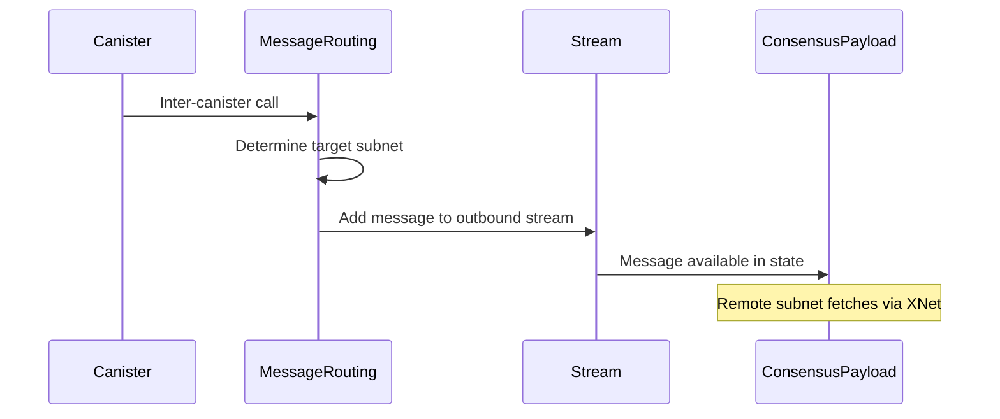
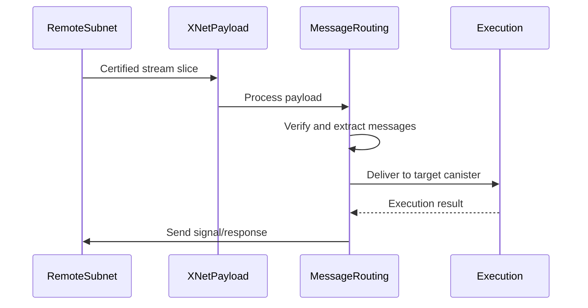

## Overview

XNet (Cross-Network) is the protocol that enables communication between different subnets in the Internet Computer. It allows canisters on one subnet to send messages to canisters on another subnet, enabling the multi-subnet architecture that gives the IC unlimited scalability.

**Location**: `rs/xnet/`

<Note>
XNet is essential for inter-canister calls that cross subnet boundaries. Without XNet, each subnet would be an isolated island.
</Note>

## Architecture

XNet consists of three main components:

<CardGroup cols={3}>
  <Card title="Payload Builder" icon="hammer" href="#payload-builder">
    Constructs XNet payloads for blocks
  </Card>
  <Card title="Payload Processing" icon="gears" href="#payload-processing">
    Processes incoming XNet messages
  </Card>
  <Card title="Message Routing" icon="route" href="#message-routing">
    Routes messages between subnets
  </Card>
</CardGroup>

## XNet Streams

### Stream Concept

Each subnet pair maintains bidirectional streams:

```
Subnet A ----Stream A→B----> Subnet B
Subnet A <---Stream B→A----- Subnet B
```

A stream contains:
- **Messages**: Canister-to-canister calls and responses
- **Signals**: Acknowledgments and reject signals
- **Header**: Stream metadata (indices, reject signals)

### Stream Structure

```rust
pub struct Stream {
    /// Messages from this subnet to the remote subnet
    pub messages: BTreeMap<StreamIndex, RequestOrResponse>,
    /// Signals indicating message processing status
    pub signals_end: StreamIndex,
    /// Reject signals for failed messages
    pub reject_signals: BTreeMap<StreamIndex, RejectSignal>,
}
```

### Stream Indices

```rust
pub struct ExpectedIndices {
    pub message_index: StreamIndex,
    pub signal_index: StreamIndex,
}
```

- **message_index**: Next expected message index
- **signal_index**: Next expected signal index

Indices provide reliable, ordered delivery semantics.

## Payload Builder

### Overview

The XNet payload builder constructs `XNetPayload` objects that are included in consensus blocks.

**Location**: `rs/xnet/payload_builder/`

### Interface

```rust
#[async_trait]
pub trait XNetPayloadBuilder: Send + Sync {
    /// Build XNet payload for the given context
    async fn get_xnet_payload(
        &self,
        validation_context: &ValidationContext,
        past_payloads: &[&XNetPayload],
        byte_limit: NumBytes,
    ) -> Result<XNetPayload, XNetPayloadError>;

    /// Validate an XNet payload
    fn validate_xnet_payload(
        &self,
        payload: &XNetPayload,
        validation_context: &ValidationContext,
        past_payloads: &[&XNetPayload],
    ) -> Result<(), XNetPayloadValidationFailure>;
}
```

### Payload Building Process

<Steps>
  <Step title="Query State Manager">
    Get the current replicated state to determine available messages
  </Step>
  
  <Step title="Fetch Stream Slices">
    Pull stream slices from remote subnets via HTTPS
  </Step>
  
  <Step title="Validate Slices">
    Verify cryptographic certificates on received slices
  </Step>
  
  <Step title="Assemble Payload">
    Combine slices into XNetPayload respecting byte limits
  </Step>
  
  <Step title="Return for Consensus">
    Provide payload to consensus for inclusion in block
  </Step>
</Steps>

### XNet Payload Structure

```rust
pub struct XNetPayload {
    /// Slices from different subnets
    pub stream_slices: BTreeMap<SubnetId, CertifiedStreamSlice>,
}

pub struct CertifiedStreamSlice {
    /// Stream slice payload
    pub payload: StreamSlicePayload,
    /// Merkle proof of slice inclusion in certified state
    pub merkle_proof: Vec<u8>,
    /// Certificate from source subnet
    pub certification: Certification,
}
```

<Info>
Each stream slice includes a cryptographic certificate that proves it came from the source subnet's certified state.
</Info>

### Certified Slice Pool

The certified slice pool caches incoming stream slices:

```rust
pub trait XNetSlicePool: Send + Sync {
    /// Take a sub-slice from the pool
    fn take_slice(
        &self,
        subnet_id: SubnetId,
        begin: Option<&ExpectedIndices>,
        msg_limit: Option<usize>,
        byte_limit: Option<usize>,
    ) -> CertifiedSliceResult<Option<(CertifiedStreamSlice, usize)>>;

    /// Garbage collect old messages
    fn garbage_collect(
        &self, 
        new_stream_positions: BTreeMap<SubnetId, ExpectedIndices>
    );
}
```

**Key features**:
- Caches slices fetched from remote subnets
- Supports taking sub-slices to fit byte limits
- Automatic garbage collection of processed messages
- Thread-safe concurrent access

## XNet Client

### HTTPS-Based Communication

XNet uses HTTPS to fetch stream slices from remote subnets.

**Endpoint**: `/api/v1/stream-slice/<subnet_id>`

### Slice Fetching

```rust
pub struct XNetClient {
    http_client: Client<TlsConnector>,
    registry_client: Arc<dyn RegistryClient>,
    tls_config: Arc<dyn TlsConfig>,
}
```

**Fetch process**:

1. **Lookup Registry**: Find IP addresses of nodes in target subnet
2. **Select Node**: Choose node based on proximity and health
3. **Establish Connection**: Create HTTPS connection with mutual TLS
4. **Send Request**: Request specific stream slice range
5. **Receive Response**: Get certified stream slice
6. **Verify Certificate**: Validate cryptographic proof
7. **Add to Pool**: Cache slice for payload building

### Proximity-Based Selection

The XNet client uses proximity metrics to select the best node:

```rust
pub struct ProximityMap {
    /// Map from subnet to nodes, ordered by proximity
    proximity: HashMap<SubnetId, Vec<NodeId>>,
}
```

**Selection strategy**:
- Prefer geographically closer nodes
- Round-robin among nodes with same proximity
- Automatic failover on connection errors
- Adaptive timeout based on historical latency

## Message Routing

### Overview

Message routing moves messages between subnets through XNet streams.

### Outbound Message Flow



### Inbound Message Flow



### Routing Logic

```rust
impl ReplicatedState {
    /// Route outbound messages to appropriate streams
    pub fn route_outbound_messages(&mut self) {
        for message in self.output_queues.drain() {
            let target_subnet = self.routing_table
                .route(message.receiver());
            
            if target_subnet == self.own_subnet_id {
                // Local delivery
                self.push_input(message);
            } else {
                // XNet delivery
                self.streams.get_mut(target_subnet)
                    .push_message(message);
            }
        }
    }
}
```

## Stream Payload Building

### Message Limits

```rust
const MAX_STREAM_MESSAGES: usize = 1000;
const SYSTEM_SUBNET_STREAM_MSG_LIMIT: usize = 2000;
```

System subnets (like NNS) have higher limits due to their coordination role.

### Signal Limits

To prevent one-sided traffic:

```rust
pub const MAX_SIGNALS: usize = MAX_STREAM_MESSAGES;
```

A subnet stops pulling messages if it has more than MAX_SIGNALS pending signals, ensuring bidirectional flow.

### Byte Limits

Payloads respect consensus byte limits:

```rust
async fn get_xnet_payload(
    &self,
    validation_context: &ValidationContext,
    past_payloads: &[&XNetPayload],
    byte_limit: NumBytes,  // Provided by consensus
) -> Result<XNetPayload, XNetPayloadError>
```

The builder incrementally adds slices until byte_limit is reached.

## Payload Validation

### Validation Rules

Consensus validates XNet payloads before including them in blocks:

<AccordionGroup>
  <Accordion title="Certificate Verification">
    - Verify each slice's certificate signature
    - Check certificate is from correct subnet
    - Validate Merkle proof inclusion
  </Accordion>

  <Accordion title="Index Consistency">
    - Verify stream indices are sequential
    - Check no gaps in message indices
    - Ensure signals reference valid messages
  </Accordion>

  <Accordion title="Size Limits">
    - Total payload size within byte_limit
    - Message count within MAX_STREAM_MESSAGES
    - Signal count within MAX_SIGNALS
  </Accordion>

  <Accordion title="Duplicate Detection">
    - No duplicate messages from past payloads
    - No overlapping stream ranges
    - Reject signals reference correct indices
  </Accordion>
</AccordionGroup>

### Validation Errors

```rust
pub enum XNetPayloadValidationFailure {
    InvalidPayload(InvalidXNetPayload),
    StateUnavailable,
    CertificationError(CertificationError),
}

pub struct InvalidXNetPayload {
    pub subnet_id: SubnetId,
    pub reason: String,
}
```

Invalid payloads are rejected by consensus, and the block proposer may be slashed.

## Garbage Collection

### Stream Garbage Collection

Processed messages must be removed to prevent unbounded growth:

```rust
impl Stream {
    /// Remove messages that have been signaled
    pub fn garbage_collect(&mut self, new_begin: StreamIndex) {
        self.messages.retain(|index, _| *index >= new_begin);
        self.reject_signals.retain(|index, _| *index >= new_begin);
    }
}
```

### GC Triggers

1. **Signal Processing**: When signals are received from remote subnet
2. **State Checkpoint**: During periodic state snapshots
3. **Stream Capacity**: When stream size exceeds thresholds

### Slice Pool GC

The certified slice pool is garbage collected based on expected indices:

```rust
slice_pool.garbage_collect(
    stream_positions  // Map of SubnetId -> ExpectedIndices
);
```

Slices for old indices are removed, and slices from removed subnets are dropped entirely.

## Error Handling

### Reject Signals

When message processing fails:

```rust
pub struct RejectSignal {
    pub reason: RejectReason,
    pub index: StreamIndex,
}

pub enum RejectReason {
    CanisterNotFound,
    CanisterStopped,
    QueueFull,
    OutOfCycles,
    // ... more reasons
}
```

Reject signals flow back through the reverse stream to notify the sender.

### Slice Fetch Errors

```rust
pub enum CertifiedSliceError {
    /// Invalid slice payload
    InvalidPayload(String),
    /// Failed to verify certificate
    CertificationError(String),
    /// Requested index before slice begin
    TakeBeforeSliceBegin,
    /// Merkle witness pruning failed
    WitnessPruningFailed,
}
```

Fetch errors trigger retry with exponential backoff and node failover.

## Performance Optimization

### Background Query Tasks

Slice fetching happens asynchronously:

```rust
let outstanding_queries = Arc::new(AtomicUsize::new(0));

tokio::spawn(async move {
    outstanding_queries.fetch_add(1, Ordering::SeqCst);
    let slice = fetch_slice(subnet_id, indices).await;
    outstanding_queries.fetch_sub(1, Ordering::SeqCst);
    slice_pool.add(slice);
});
```

**Benefits**:
- Non-blocking payload building
- Parallel fetches from multiple subnets
- Overlap network I/O with computation

### Slice Caching

Certified slice pool reduces redundant fetches:

- Cache valid slices between rounds
- Reuse slices across multiple payloads
- Incremental updates (fetch only new messages)

### Proximity Optimization

Node selection minimizes latency:

- Prefer geographically close nodes
- Adapt to network conditions
- Cache proximity measurements

## Metrics and Monitoring

### Payload Building Metrics

```rust
pub struct XNetPayloadBuilderMetrics {
    pub build_payload_duration: HistogramVec,
    pub pull_attempt_count: IntCounterVec,
    pub query_slice_duration: HistogramVec,
    pub slice_messages: Histogram,
    pub slice_payload_size: Histogram,
    pub validate_payload_duration: HistogramVec,
    pub outstanding_queries: IntGauge,
}
```

**Key metrics**:
- `xnet_builder_build_payload_duration_seconds`: Time to build payload
- `xnet_builder_pull_attempt_count`: Slice fetch attempts by status
- `xnet_builder_query_slice_duration_seconds`: Time to fetch slice
- `xnet_builder_slice_messages`: Message count per slice
- `xnet_builder_slice_payload_size_bytes`: Slice size distribution
- `xnet_builder_outstanding_queries`: Concurrent fetch operations

### Critical Errors

Critical errors are tracked separately:

- `xnet_slice_count_bytes_failed`: Slice byte counting failures
- `xnet_slice_count_bytes_invalid`: Byte count mismatches

These indicate serious bugs that need immediate attention.

## Security Considerations

### Certificate Validation

All stream slices must be certified:

1. **Signature Verification**: Validate threshold signature
2. **Merkle Proof**: Verify slice is in certified state tree
3. **Subnet Identity**: Check certificate is from expected subnet
4. **Registry Verification**: Validate against registry-stored keys

<Warning>
Never process uncertified slices. This could allow malicious subnets to inject fake messages.
</Warning>

### Message Authentication

Inter-canister messages are authenticated:

- Sender canister ID embedded in message
- Validated by source subnet before adding to stream
- Cannot be forged by intermediate parties

### Resource Limits

Protection against resource exhaustion:

- Maximum message count per stream
- Maximum signal count per stream
- Byte limits on payloads
- Rate limiting on slice queries

## Subnet Topology Changes

### Adding Subnets

When a new subnet joins:

1. Registry updated with subnet record
2. Routing table updated on all subnets
3. New streams automatically created
4. XNet client discovers new nodes

### Removing Subnets

When a subnet is removed:

1. Outstanding messages are processed or rejected
2. Streams drained and garbage collected
3. Slice pool entries removed
4. Routing table updated

### Node Changes

Node additions/removals within a subnet:

- XNet client adapts based on registry
- No disruption to message flow
- Automatic failover to healthy nodes

## Testing

### Unit Tests

Comprehensive test coverage:

- Stream slice validation
- Index handling and garbage collection
- Certificate verification
- Payload assembly and validation

### Integration Tests

End-to-end scenarios:

- Multi-subnet message routing
- Reject signal handling
- Node failover
- Topology changes

### Property-Based Tests

QuickCheck-style tests for:

- Stream index invariants
- GC correctness
- Byte counting accuracy

## Future Enhancements

<CardGroup cols={2}>
  <Card title="Streaming" icon="water">
    Support for streaming large messages across multiple rounds
  </Card>
  <Card title="Compression" icon="file-zipper">
    Compress stream slices to reduce bandwidth
  </Card>
  <Card title="Batching" icon="layer-group">
    Improved batching strategies for small messages
  </Card>
  <Card title="QoS" icon="gauge-high">
    Quality of service for priority messages
  </Card>
</CardGroup>

## Related APIs

<CardGroup cols={2}>
  <Card title="P2P Layer" icon="network-wired" href="/api/networking/p2p">
    Subnet-internal message delivery
  </Card>
  <Card title="HTTP Endpoints" icon="globe" href="/api/networking/http-endpoints">
    Public HTTP API interfaces
  </Card>
</CardGroup>

## Source Code References

- XNet implementation: `rs/xnet/`
- Payload builder: `rs/xnet/payload_builder/src/lib.rs`
- Certified slice pool: `rs/xnet/payload_builder/src/certified_slice_pool.rs`
- XNet client: `rs/xnet/hyper/src/lib.rs`
- Stream URI: `rs/xnet/uri/`
- Message routing: `rs/messaging/src/routing.rs`
- XNet endpoint: `rs/http_endpoints/xnet/`