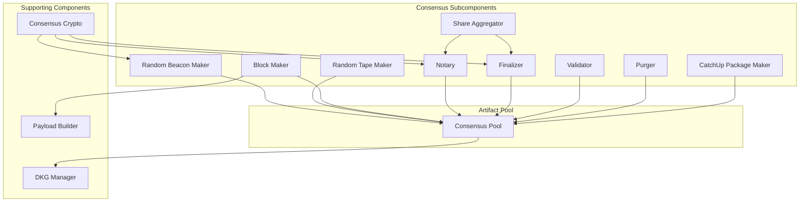

The consensus protocol is the core mechanism by which nodes in an Internet Computer subnet agree on the state of the blockchain. It combines a novel consensus algorithm with distributed key generation (DKG) and threshold cryptography.

## Overview

The consensus implementation is located in `rs/consensus/` and provides:

- Byzantine fault-tolerant consensus
- Finality in seconds
- Random beacon for unpredictable randomness
- Distributed key generation (DKG)
- Threshold signatures for efficient verification
- Catch-up packages (CUPs) for fast synchronization

<Info>
  The consensus protocol can tolerate up to f Byzantine (malicious) nodes in a subnet of 3f+1 nodes, maintaining safety and liveness.
</Info>

## Consensus Architecture



## Source Code Structure

The consensus implementation (`rs/consensus/src/`) contains:

```
rs/consensus/src/
├── consensus.rs              # Main consensus module
├── consensus/
│   ├── block_maker.rs        # Block proposal
│   ├── notary.rs             # Block notarization
│   ├── finalizer.rs          # Block finalization
│   ├── random_beacon_maker.rs # Random beacon generation
│   ├── random_tape_maker.rs  # Random tape generation
│   ├── share_aggregator.rs   # Threshold signature aggregation
│   ├── validator.rs          # Artifact validation
│   ├── purger.rs             # Pool cleanup
│   ├── catchup_package_maker.rs # CUP creation
│   ├── batch_delivery.rs     # Batch delivery to execution
│   ├── payload_builder.rs    # Block payload construction
│   └── ...
└── lib.rs                    # Module exports
```

## Consensus Subcomponents

From `rs/consensus/src/consensus.rs:87`, the consensus system consists of nine subcomponents:

```rust
enum ConsensusSubcomponent {
    Notary,
    Finalizer,
    RandomBeaconMaker,
    RandomTapeMaker,
    BlockMaker,
    CatchUpPackageMaker,
    Validator,
    Aggregator,
    Purger,
}
```

### Random Beacon Maker

Generates random beacons using threshold signatures:

- Produces one beacon per round
- Provides unpredictable, verifiable randomness
- Used for leader election and round progression
- Based on threshold BLS signatures

<Accordion title="Random Beacon Properties">
  - **Unpredictability**: No party can predict future values
  - **Verifiability**: Anyone can verify beacon validity
  - **Availability**: Generated every round without coordination
  - **Uniqueness**: Only one valid beacon per height
</Accordion>

### Random Tape Maker

Generates random tapes for deterministic randomness within a round:

- One tape per round
- Used by execution environment for random number generation
- Deterministic across all nodes
- Based on threshold signatures

### Block Maker

Proposes new blocks:

- Selects block proposer using random beacon
- Constructs block payload via payload builders
- References parent block and random beacon
- Signs and publishes block proposal

**Block Contents:**
- Parent block hash
- Height
- Random beacon reference
- Payload (ingress messages, XNet messages, etc.)
- DKG dealings (when applicable)

### Payload Builder

Constructs block payloads from multiple sources:

```rust
// From rs/consensus/src/consensus.rs:27
use crate::consensus::payload_builder::PayloadBuilderImpl;
```

Payload types:
- **Ingress**: User-submitted messages
- **XNet**: Cross-subnet messages
- **Self-Validating**: Bitcoin, HTTPS outcalls
- **Query Stats**: Query statistics aggregation
- **Canister HTTP**: Outgoing HTTP requests

Location: `rs/consensus/src/consensus/payload_builder.rs`

### Notary

Notarizes valid blocks:

- Validates proposed blocks
- Creates threshold signature shares
- Aggregates shares into notarizations
- Ensures only one block per height is notarized

<Note>
  A block is notarized when it receives threshold signature shares from ≥2f+1 nodes, where 3f+1 is the subnet size.
</Note>

### Share Aggregator

Aggregates threshold signature shares:

- Collects shares from multiple nodes
- Combines shares once threshold is reached
- Produces full threshold signatures
- Used for notarizations, finalizations, and random beacons

Location: `rs/consensus/src/consensus/share_aggregator.rs`

### Finalizer

Finalizes notarized blocks:

- Selects highest notarized block
- Creates finalization shares
- Aggregates shares into finalizations
- Triggers batch delivery to execution

**Finalization guarantees:**
- Finalized blocks are immutable
- No conflicting blocks can be finalized
- Finalization triggers execution

### Validator

Validates consensus artifacts before accepting them:

- Checks cryptographic signatures
- Verifies artifact structure and content
- Ensures artifacts follow protocol rules
- Validates membership and permissions

Location: `rs/consensus/src/consensus/validator.rs`

### Purger

Cleans up old artifacts from the consensus pool:

- Removes artifacts below certified height
- Maintains bounded pool size
- Preserves artifacts needed for catch-up
- Runs periodically to prevent unbounded growth

Location: `rs/consensus/src/consensus/purger.rs`

### CatchUp Package Maker

Creates catch-up packages for fast synchronization:

- Bundles finalized state with signatures
- Enables nodes to skip past rounds
- Created at DKG intervals
- Signed by subnet threshold key

Location: `rs/consensus/src/consensus/catchup_package_maker.rs`

## Height Bounds

To maintain bounded consensus pool size, the protocol enforces height gaps:

```rust
// From rs/consensus/src/consensus.rs:75
pub(crate) const ACCEPTABLE_NOTARIZATION_CERTIFICATION_GAP: u64 = 70;
pub(crate) const ACCEPTABLE_NOTARIZATION_CUP_GAP: u64 = 130;
```

- **Notarization-Certification Gap**: Maximum 70 heights between notarized and certified heights
- **Notarization-CUP Gap**: Maximum 130 heights between notarized height and next CUP

These bounds prevent:
- Unbounded pool growth
- Resource exhaustion attacks
- Excessive validation work

## Distributed Key Generation (DKG)

DKG generates threshold keys for subnet consensus:

```rust
use ic_consensus_dkg::DkgKeyManager;
```

### DKG Process

<Steps>
  <Step title="Initiation">
    DKG starts at configured intervals (e.g., every 500 rounds)
  </Step>
  
  <Step title="Dealing Phase">
    Each node creates and broadcasts secret shares (dealings)
  </Step>
  
  <Step title="Verification">
    Nodes verify received dealings for correctness
  </Step>
  
  <Step title="Aggregation">
    Valid dealings are aggregated into summary
  </Step>
  
  <Step title="Key Derivation">
    Each node derives its share of the threshold key
  </Step>
  
  <Step title="Activation">
    New key becomes active at next CUP
  </Step>
</Steps>

### DKG Purposes

- **Consensus Signing**: Threshold signatures for consensus artifacts
- **State Certification**: Certifying replicated state
- **Key Rotation**: Periodic key refresh for security
- **Membership Changes**: New keys when subnet membership changes

## Threshold Cryptography

The consensus protocol heavily relies on threshold signatures:

### Threshold Signature Properties

<CardGroup cols={2}>
  <Card title="Non-Interactive" icon="bolt">
    No coordination needed to create shares
  </Card>
  <Card title="Verifiable" icon="shield-check">
    Individual shares can be verified
  </Card>
  <Card title="Efficient" icon="gauge-high">
    Single signature verifies like individual signature
  </Card>
  <Card title="Threshold" icon="users">
    Requires t-of-n shares (typically 2f+1 of 3f+1)
  </Card>
</CardGroup>

### Signature Types

**BLS Signatures**: Used for random beacon and consensus artifacts
- Compact signatures
- Efficient aggregation
- Deterministic

**Threshold ECDSA**: Used for chain key cryptography (Bitcoin, Ethereum integration)
- Compatible with external blockchains
- Secure key derivation
- Non-interactive signing

Location: `rs/crypto/`

## Consensus Pool

The consensus pool stores validated artifacts:

```rust
// From rs/replica/src/setup_ic_stack.rs:3
use ic_artifact_pool::consensus_pool::ConsensusPoolImpl;
```

Artifact types:
- Blocks
- Notarizations
- Finalizations  
- Random beacons
- Random tapes
- Catch-up packages
- DKG messages

The pool is persisted to disk and loaded on restart.

## Batch Delivery

Once a block is finalized, its batch is delivered to execution:

```rust
// From rs/consensus/src/consensus/batch_delivery.rs
```

**Delivery process:**
1. Finalizer detects finalized block
2. Batch is extracted from block
3. Batch sent to Message Routing
4. Message Routing processes batch
5. Execution Environment executes messages

Location: `rs/consensus/src/consensus/batch_delivery.rs`

## Parallelism

Consensus uses parallel processing for performance:

```rust
// From rs/consensus/src/consensus.rs:85
pub const MAX_CONSENSUS_THREADS: usize = 16;
```

Parallel operations:
- Block payload validation
- Artifact signature verification
- DKG dealing verification
- State hash computation

A Rayon thread pool manages parallel work.

## Testing Framework

The consensus crate includes a sophisticated test framework described in `rs/consensus/README.adoc:3`:

### Multi-Node Simulation

Runs consensus without real networking:

```bash
RUST_LOG=Debug cargo test --test integration multiple_nodes_are_live -- --nocapture
```

### Configuration Parameters

Set via environment variables:

<ParamField path="RANDOM_SEED" type="number | 'Random'">
  Seed for deterministic randomness (default: 0)
</ParamField>

<ParamField path="NUM_NODES" type="number | 'Random'">
  Number of nodes in simulation (default: 10)
</ParamField>

<ParamField path="NUM_ROUNDS" type="number">
  Rounds to run (default: random 10-100)
</ParamField>

<ParamField path="MAX_DELTA" type="number">
  Maximum message latency in ms (default: 1000)
</ParamField>

<ParamField path="EXECUTION" type="'GlobalMessage' | 'GlobalClock' | 'RandomExecute'">
  Execution strategy (default: random)
</ParamField>

<ParamField path="DELIVERY" type="'Sequential' | 'RandomReceive' | 'RandomGraph'">
  Message delivery strategy (default: random)
</ParamField>

<ParamField path="DEGREE" type="number">
  Graph degree for RandomGraph delivery (default: random)
</ParamField>

### Example Test Run

```bash
NUM_NODES=6 NUM_ROUNDS=100 RUST_LOG=Debug \
  cargo test --test integration multiple_nodes_are_live -- --nocapture
```

Output includes:
```
INFO ConsensusRunnerConfig { 
  max_delta: 1000, 
  random_seed: 0, 
  num_nodes: 10, 
  num_rounds: 12, 
  degree: 9, 
  execution: GlobalClock, 
  delivery: Sequential 
}
```

### Stress Testing

Run continuous random tests:

```bash
while true; do \
  RUST_LOG=Info,ic_consensus::finalizer=Debug \
  NUM_NODES=Random RANDOM_SEED=Random \
  cargo test --test integration multiple_nodes_are_live -- --nocapture \
    || break; \
done
```

This catches non-deterministic bugs and edge cases.

## Performance Characteristics

### Finality Time

- **Target**: 1-2 seconds per round
- **Factors**: Network latency, payload size, validation time
- **Optimization**: Parallel validation, efficient crypto

### Throughput

- **Block rate**: ~1 block per second
- **Batch size**: Configurable, typically thousands of messages
- **Scalability**: Linear with subnet size up to limits

### Resource Usage

- **CPU**: Primarily crypto operations (signatures, hashing)
- **Memory**: Bounded by pool size and height gaps
- **Disk**: Persistent pool grows with chain height
- **Network**: Broadcasts scale with subnet size

## Security Properties

<AccordionGroup>
  <Accordion title="Safety">
    No two conflicting blocks can be finalized at the same height, even with f Byzantine nodes.
  </Accordion>
  
  <Accordion title="Liveness">
    Progress continues as long as ≥2f+1 nodes are honest and network is eventually synchronous.
  </Accordion>
  
  <Accordion title="Unpredictability">
    Random beacon provides unpredictable randomness that no party can bias.
  </Accordion>
  
  <Accordion title="Verifiability">
    All consensus artifacts are cryptographically verifiable by any party.
  </Accordion>
</AccordionGroup>

## Integration Points

### Registry

Consensus reads subnet configuration from registry:
- Subnet membership
- DKG intervals
- Block time parameters
- Notarization delay settings

```rust
use ic_registry_client_helpers::subnet::SubnetRegistry;
```

### Message Routing

Consensus delivers finalized batches:

```rust
use ic_interfaces::messaging::MessageRouting;
```

See [Execution Environment](/architecture/execution-environment).

### P2P Layer

Consensus artifacts are distributed via P2P:

```rust
use ic_interfaces::p2p::consensus::PoolMutationsProducer;
```

See [Networking](/architecture/networking).

### State Manager

Consensus uses certified state for validation:

```rust
use ic_interfaces_state_manager::StateManager;
```

## Best Practices

<Warning>
  Consensus must be **deterministic**. Any non-determinism leads to state divergence and subnet halt.
</Warning>

<Tip>
  When debugging consensus issues:
  1. Check random beacon progression
  2. Verify notarization shares
  3. Monitor finalization gaps
  4. Review validator logs
</Tip>

## Further Reading

<CardGroup cols={2}>
  <Card title="Replica" icon="server" href="/architecture/replica">
    Understand replica structure
  </Card>
  <Card title="Execution" icon="microchip" href="/architecture/execution-environment">
    Learn about message execution
  </Card>
  <Card title="Networking" icon="network-wired" href="/architecture/networking">
    Explore artifact distribution
  </Card>
  <Card title="Overview" icon="sitemap" href="/architecture/overview">
    Return to architecture overview
  </Card>
</CardGroup>
