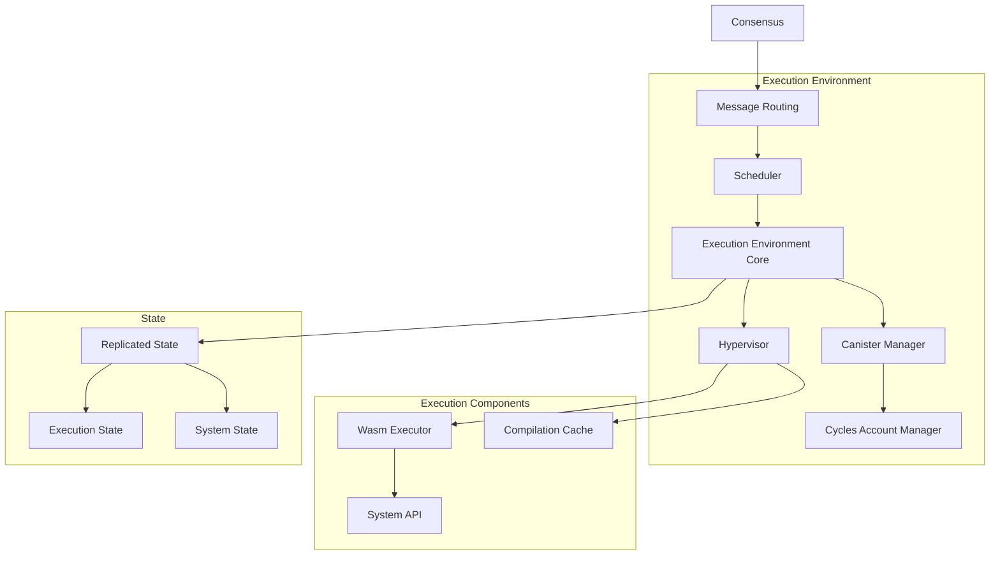
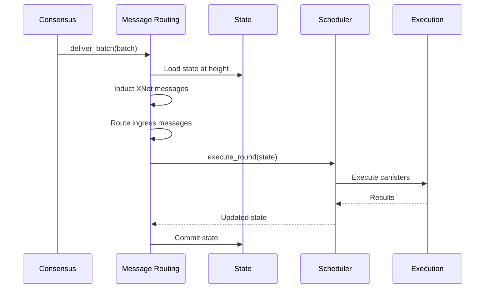
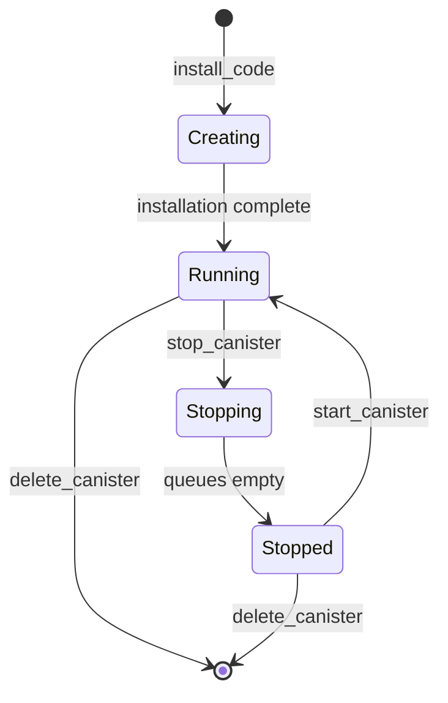

The Execution Environment is responsible for executing canister smart contracts on the Internet Computer. It provides a secure, deterministic runtime environment with fair scheduling and resource management.

## Overview

The execution environment implementation is located in `rs/execution_environment/` and provides:

- **Canister Execution**: WebAssembly-based smart contract execution
- **Message Routing**: Routing messages to and from canisters
- **Scheduler**: Fair, deterministic scheduling across canisters
- **Hypervisor**: Sandboxed Wasm runtime with system API
- **Cycles Management**: Resource accounting and payment
- **Ingress Filtering**: Input validation for user messages

## Architecture



## Source Code Structure

```
rs/execution_environment/
├── src/
│   ├── lib.rs                      # Main exports and ExecutionServices
│   ├── execution_environment.rs    # Core execution logic
│   ├── scheduler.rs                # Round scheduling
│   ├── hypervisor.rs               # WebAssembly runtime
│   ├── canister_manager.rs         # Canister lifecycle
│   ├── query_handler.rs            # Query execution
│   ├── ingress_filter.rs           # Ingress validation
│   ├── history.rs                  # Ingress history tracking
│   ├── execution/                  # Execution implementations
│   │   ├── call_or_task.rs        # Call execution
│   │   ├── install.rs             # Canister installation
│   │   ├── install_code.rs        # Code installation logic
│   │   └── nonreplicated_query.rs # Query execution
│   └── ...
├── benches/                        # Performance benchmarks
├── tests/                          # Integration tests
├── Contributing.md                 # Contribution guidelines
└── EXECUTION_COST.md              # Cost model documentation
```

## Execution Services

From `rs/execution_environment/src/lib.rs:86`, the execution environment exports public services:

```rust
pub struct ExecutionServices {
    pub ingress_filter: IngressFilterService,
    pub ingress_history_writer: Arc<IngressHistoryWriterImpl>,
    pub ingress_history_reader: Box<dyn IngressHistoryReader>,
    pub query_execution_service: QueryExecutionService,
    pub transform_execution_service: TransformExecutionService,
    pub scheduler: Box<dyn Scheduler<State = ReplicatedState>>,
    pub query_stats_payload_builder: QueryStatsPayloadBuilderParams,
    pub cycles_account_manager: Arc<CyclesAccountManager>,
}
```

## Message Routing

Message Routing coordinates message flow between consensus and execution:

### Message Flow



### Responsibilities

From `rs/messaging/src/message_routing.rs:8`:

- Receive finalized batches from consensus
- Load replicated state at batch height
- Induct XNet messages from other subnets
- Route ingress messages to canisters
- Trigger scheduler execution
- Commit updated state
- Generate execution summaries

Location: `rs/messaging/`

## Scheduler

The scheduler manages fair execution across canisters within a round.

### Scheduler Implementation

From `rs/execution_environment/src/scheduler.rs:139`:

```rust
pub(crate) struct SchedulerImpl {
    config: SchedulerConfig,
    hypervisor_config: HypervisorConfig,
    own_subnet_id: SubnetId,
    ingress_history_writer: Arc<dyn IngressHistoryWriter<State = ReplicatedState>>,
    exec_env: Arc<ExecutionEnvironment>,
    cycles_account_manager: Arc<CyclesAccountManager>,
    metrics: Arc<SchedulerMetrics>,
    // ...
}
```

### Round Limits

From `rs/execution_environment/src/scheduler.rs:75`:

```rust
struct SchedulerRoundLimits {
    instructions: RoundInstructions,
    subnet_instructions: RoundInstructions,
    subnet_available_memory: SubnetAvailableMemory,
    subnet_available_callbacks: i64,
    compute_allocation_used: u64,
    subnet_memory_reservation: NumBytes,
}
```

These limits ensure:
- Bounded execution time per round
- Fair resource distribution
- Memory availability
- Callback quota management

### Scheduling Algorithm

<Steps>
  <Step title="Prioritization">
    Determine canister execution order based on compute allocation and priority
  </Step>
  
  <Step title="Subnet Messages">
    Execute subnet messages first (limited by `SUBNET_MESSAGES_LIMIT_FRACTION` from line 71)
  </Step>
  
  <Step title="Canister Execution">
    Execute canisters in round-robin fashion until limits exhausted
  </Step>
  
  <Step title="Response Processing">
    Process responses and update queues
  </Step>
  
  <Step title="Cleanup">
    Remove completed tasks and update metrics
  </Step>
</Steps>

### Fair Scheduling

The scheduler ensures fairness through:

- **Compute Allocation**: Reserved execution time per canister
- **Round-Robin**: Equal opportunity for all canisters
- **Priority Levels**: Higher priority for critical operations
- **Backpressure**: Queue limits prevent resource exhaustion

## Hypervisor

The Hypervisor provides the WebAssembly runtime environment.

### Hypervisor Structure

From `rs/execution_environment/src/hypervisor.rs:115`:

```rust
pub struct Hypervisor {
    wasm_executor: Arc<dyn WasmExecutor>,
    metrics: Arc<HypervisorMetrics>,
    own_subnet_id: SubnetId,
    log: ReplicaLogger,
    cycles_account_manager: Arc<CyclesAccountManager>,
    compilation_cache: Arc<CompilationCache>,
    cost_to_compile_wasm_instruction: NumInstructions,
    dirty_page_overhead: NumInstructions,
    canister_guaranteed_callback_quota: usize,
}
```

### WebAssembly Execution

<Accordion title="Wasm Execution Flow">
  1. **Module Loading**: Load canister Wasm module
  2. **Compilation**: JIT compile to native code (cached)
  3. **Instrumentation**: Inject metering and safety checks
  4. **Instantiation**: Create Wasm instance with memory
  5. **Execution**: Run method with instruction limits
  6. **Metering**: Track instruction and memory usage
  7. **Result**: Return output or trap
</Accordion>

### Compilation and Caching

From `rs/execution_environment/src/hypervisor.rs:5`:

```rust
use ic_embedders::{
    CompilationCache, CompilationCacheBuilder, CompilationResult,
    WasmExecutionInput, WasmtimeEmbedder,
    wasm_executor::{WasmExecutionResult, WasmExecutor, WasmExecutorImpl},
};
```

Compilation optimizations:
- **Compilation Cache**: Reuse compiled code across executions
- **Lazy Compilation**: Compile on first use
- **Compilation Costs**: Charged to canisters (line 149)
- **Validation**: Ensure Wasm safety before compilation

Location: `rs/embedders/`

### System API

The System API provides canisters access to IC capabilities:

<CardGroup cols={2}>
  <Card title="Messaging" icon="envelope">
    Send/receive inter-canister messages
  </Card>
  <Card title="State" icon="database">
    Access stable memory and heap
  </Card>
  <Card title="Crypto" icon="key">
    Cryptographic operations (hash, sign)
  </Card>
  <Card title="Management" icon="gear">
    Canister lifecycle operations
  </Card>
  <Card title="Time" icon="clock">
    Access current timestamp
  </Card>
  <Card title="Random" icon="dice">
    Get deterministic randomness
  </Card>
  <Card title="Cycles" icon="coins">
    Query and transfer cycles
  </Card>
  <Card title="HTTP" icon="globe">
    Make HTTPS outcalls
  </Card>
</CardGroup>

System API implementation: `rs/embedders/src/wasmtime_embedder/system_api/`

### Sandboxing

For security, canister execution is sandboxed:

```rust
// From rs/execution_environment/src/hypervisor.rs:1
use ic_canister_sandbox_backend_lib::replica_controller
    ::sandboxed_execution_controller::SandboxedExecutionController;
```

**Sandbox features:**
- **Process Isolation**: Separate OS process per canister
- **Resource Limits**: CPU, memory, and instruction bounds
- **System Call Filtering**: Only allowed syscalls permitted
- **Capability-based**: Explicit permissions required

Location: `rs/canister_sandbox/`

## Canister Lifecycle

The Canister Manager handles canister lifecycle operations.

### Lifecycle States



### Management Canister API

From `rs/execution_environment/Contributing.md:1`, the Management Canister provides:

- `install_code`: Install Wasm module in canister
- `install_chunked_code`: Install large modules in chunks
- `uninstall_code`: Remove code from canister
- `start_canister`: Resume canister execution
- `stop_canister`: Pause canister execution
- `canister_status`: Query canister status
- `delete_canister`: Permanently delete canister
- `update_settings`: Change canister settings
- `create_canister`: Allocate new canister ID

### Installation Process

<Steps>
  <Step title="Validation">
    Validate Wasm module structure and size limits
  </Step>
  
  <Step title="Compilation">
    Compile Wasm to native code (charged to canister)
  </Step>
  
  <Step title="State Creation">
    Initialize execution state and system state
  </Step>
  
  <Step title="Init Method">
    Run canister's `canister_init` method
  </Step>
  
  <Step title="Activation">
    Mark canister as running and ready
  </Step>
</Steps>

Location: `rs/execution_environment/src/execution/install_code.rs`

## Query Execution

Queries are read-only operations that don't go through consensus.

### Query Types

From `rs/execution_environment/src/lib.rs:60`:

```rust
pub enum QueryExecutionType {
    Replicated,
    NonReplicated {
        call_context_id: CallContextId,
        network_topology: Arc<NetworkTopology>,
        query_kind: NonReplicatedQueryKind,
    },
}

pub enum NonReplicatedQueryKind {
    Stateful { call_origin: CallOrigin },
    Pure { caller: PrincipalId },
}
```

### Query Handler

Queries are processed by the Query Handler:

- **No consensus**: Executed locally without consensus
- **Read-only**: Cannot modify state
- **Fast**: Millisecond response times
- **Eventually consistent**: May return stale state

For consistency, use **certified queries** with state certification.

Location: `rs/execution_environment/src/query_handler.rs`

## Cycles and Resource Management

The Internet Computer uses a **cycles** model for resource accounting.

### Cycles Account Manager

From `rs/execution_environment/src/lib.rs:88`:

```rust
pub cycles_account_manager: Arc<CyclesAccountManager>
```

Location: `rs/cycles_account_manager/`

### Resource Costs

Canisters pay cycles for:

- **Execution**: Per instruction executed
- **Storage**: Per byte of memory over time
- **Network**: Per byte of messages sent
- **Compilation**: One-time cost for Wasm compilation

<Info>
  See `rs/execution_environment/EXECUTION_COST.md` for detailed cost model.
</Info>

### Cycles Operations

- **Charging**: Deduct cycles before operations
- **Refunds**: Return unused cycles
- **Transfers**: Send cycles with inter-canister calls
- **Minting**: Controllers can add cycles
- **Burning**: Unused cycles are burned

### Memory Limits

Memory allocation is tracked and limited:

```rust
// From rs/execution_environment/src/scheduler.rs:83
subnet_available_memory: SubnetAvailableMemory,
```

Memory types:
- **Wasm Memory**: Canister heap
- **Stable Memory**: Persistent storage
- **Message Memory**: Queues and messages
- **Subnet Memory**: Total available across subnet

## Ingress Filtering

Ingress messages are filtered before execution:

```rust
// From rs/execution_environment/src/lib.rs:19
use crate::ingress_filter::IngressFilterServiceImpl;
```

### Filter Checks

<Accordion title="Ingress Filter Validations">
  - **Signature Verification**: Validate sender signature
  - **Expiry Check**: Ensure message not expired
  - **Canister Status**: Verify canister is running
  - **Method Permissions**: Check method accessibility
  - **Rate Limiting**: Prevent spam
  - **Cycles Balance**: Ensure sufficient cycles
</Accordion>

Location: `rs/execution_environment/src/ingress_filter.rs`

## Ingress History

Ingress history tracks message execution status:

```rust
// From rs/execution_environment/src/lib.rs:26
pub use history::{IngressHistoryReaderImpl, IngressHistoryWriterImpl};
```

Status values:
- `Received`: Message accepted
- `Processing`: Under execution
- `Completed`: Successfully executed
- `Failed`: Execution failed
- `Done`: Final state (pruned after TTL)

Clients poll ingress status to track message progress.

Location: `rs/execution_environment/src/history.rs`

## Determinism

<Warning>
  **All execution must be deterministic** to ensure replicas reach identical state.
</Warning>

Determinism mechanisms:

### Deterministic Randomness

Randomness comes from consensus Random Tape:
- Generated via threshold signatures
- Identical across all replicas
- Unpredictable before generation

### Instruction Metering

Precise instruction counting ensures:
- Identical execution limits
- Fair resource allocation
- Reproducible execution

### Controlled Time

Timestamps come from consensus:
- Fixed per batch
- No wall-clock dependency
- Monotonically increasing

### Floating Point

WebAssembly floating-point is deterministic:
- IEEE 754 compliance
- Consistent rounding modes
- No NaN payload variation

## Performance Optimizations

### Parallel Execution

From `rs/execution_environment/src/scheduler.rs:149`:

```rust
thread_pool: RefCell<scoped_threadpool::Pool>,
```

Canisters execute in parallel when:
- No message dependencies
- Sufficient resources
- Multiple cores available

### Copy-on-Write Memory

Query execution uses CoW memory:
- Queries don't copy full memory
- Writes create private copies
- Reduces memory overhead

From `rs/execution_environment/src/lib.rs:57`:

```rust
/// When executing a wasm method of query type, this enum indicates if we are
/// running in an replicated or non-replicated context. This information is
/// needed for various purposes and in particular to support the CoW memory
/// work.
```

### Compilation Caching

Compiled Wasm is cached:
- In-memory cache (LRU)
- Persistent disk cache
- Shared across executions
- Bounded size (`MAX_COMPILATION_CACHE_SIZE`)

## Testing

### Test Frameworks

From `rs/execution_environment/Contributing.md:41`:

**ExecutionTest**: Default framework for unit tests
- Fast, lightweight
- Mocked dependencies
- Direct component testing

**StateMachine**: Integration testing
- Full consensus simulation
- Inter-canister calls
- State manager integration
- Checkpointing

Location: `rs/execution_environment/tests/`

### Benchmarks

Performance benchmarks measure:
- System API call overhead
- Wasm execution speed
- Compilation time
- Scheduler throughput

Location: `rs/execution_environment/benches/`

## Integration Points

### Consensus

Receives finalized batches for execution:

```rust
use ic_types::batch::{Batch, BatchContent};
```

### State Manager

Loads and commits replicated state:

```rust
use ic_interfaces_state_manager::{StateReader, StateManager};
```

### Registry

Reads execution settings:

```rust
use ic_interfaces::execution_environment::RegistryExecutionSettings;
```

### Crypto

Threshold signatures and randomness:

```rust
use ic_types::{Randomness, ReplicaVersion};
```

## Best Practices

<Tip>
  When implementing new Management Canister APIs, follow the guide in `rs/execution_environment/Contributing.md:1`
</Tip>

<Warning>
  Always define a clear rollback point during execution. No changes before that point, no failures after. (Contributing.md:35)
</Warning>

<Info>
  Use feature flags for experimental APIs and roll out gradually via feature releases (Contributing.md:39)
</Info>

## Further Reading

<CardGroup cols={2}>
  <Card title="Replica" icon="server" href="/architecture/replica">
    Understand replica structure
  </Card>
  <Card title="Consensus" icon="handshake" href="/architecture/consensus">
    Learn about batch finalization
  </Card>
  <Card title="Networking" icon="network-wired" href="/architecture/networking">
    Explore message transport
  </Card>
  <Card title="Overview" icon="sitemap" href="/architecture/overview">
    Return to architecture overview
  </Card>
</CardGroup>
