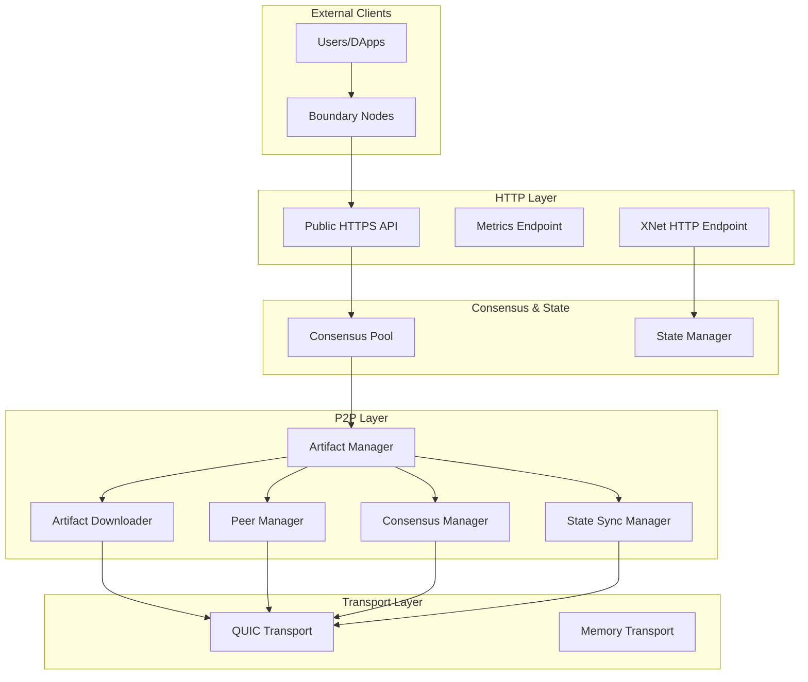
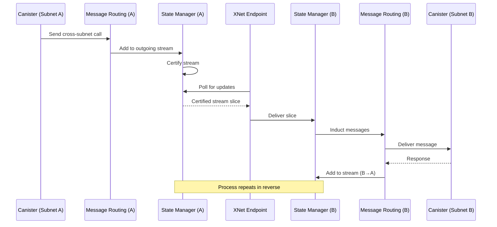
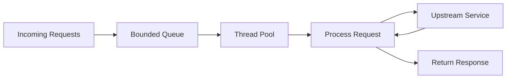

The networking layer of the Internet Computer handles all communication between nodes, subnets, and external clients. It provides reliable, secure, and efficient message delivery using modern networking protocols.

## Overview

The networking implementation spans several crates:

- **P2P Layer** (`rs/p2p/`): Intra-subnet node communication
- **HTTP Endpoints** (`rs/http_endpoints/`): External client API
- **XNet** (distributed): Cross-subnet messaging
- **Transport** (various): QUIC, TCP, memory transports

## Network Architecture



## P2P Networking

From `rs/p2p/README.adoc:1`, the P2P layer is responsible for message delivery within subnets.

### P2P Overview

Key characteristics:
- Each subnet operates a separate P2P network
- Nodes within a subnet send messages to each other
- Multiple components use P2P (consensus, state sync, etc.)
- Built on modern QUIC protocol

Location: `rs/p2p/`

### P2P Components

```
rs/p2p/
├── artifact_downloader/     # Downloads artifacts from peers
├── artifact_manager/        # Coordinates artifact distribution
├── consensus_manager/       # Consensus-specific P2P logic
├── peer_manager/            # Peer discovery and management
├── quic_transport/          # QUIC-based transport
├── state_sync_manager/      # State synchronization
├── memory_transport/        # In-memory transport (testing)
└── test_utils/              # Testing utilities
```

### Artifact Manager

The Artifact Manager coordinates P2P distribution:

```rust
// From rs/replica/src/setup_ic_stack.rs:14
use ic_interfaces::p2p::artifact_manager::JoinGuard;
```

Responsibilities:
- Manage artifact pools (consensus, DKG, ECDSA)
- Coordinate downloads from peers
- Handle uploads to peers
- Apply prioritization and filtering
- Provide backpressure

The artifact manager spawns background tasks that return `JoinGuard` handles.

### Consensus Manager

Consensus-specific P2P logic:

- Advertises consensus artifacts (blocks, notarizations, etc.)
- Requests missing artifacts
- Validates received artifacts
- Provides priority-based download

Location: `rs/p2p/consensus_manager/`

### State Sync Manager

Handles state synchronization between nodes:

<Steps>
  <Step title="Detection">
    Detect when node state lags behind subnet
  </Step>
  
  <Step title="Manifest Request">
    Request state manifest from peers
  </Step>
  
  <Step title="Chunk Download">
    Download state chunks in parallel
  </Step>
  
  <Step title="Verification">
    Verify chunks against manifest hashes
  </Step>
  
  <Step title="Assembly">
    Assemble complete state from chunks
  </Step>
  
  <Step title="Certification">
    Verify state certification before applying
  </Step>
</Steps>

Location: `rs/p2p/state_sync_manager/`

### Peer Manager

Manages peer connections and discovery:

- Maintains connections to subnet peers
- Handles peer addition/removal
- Monitors connection health
- Applies connection limits
- Manages peer reputation

Location: `rs/p2p/peer_manager/`

### QUIC Transport

QUIC (Quick UDP Internet Connections) provides the transport layer:

**QUIC Benefits:**
<CardGroup cols={2}>
  <Card title="Low Latency" icon="gauge-high">
    0-RTT connection establishment
  </Card>
  <Card title="Multiplexing" icon="code-branch">
    Multiple streams per connection
  </Card>
  <Card title="Security" icon="lock">
    Built-in TLS 1.3 encryption
  </Card>
  <Card title="Reliability" icon="shield-check">
    Packet loss recovery
  </Card>
</CardGroup>

Location: `rs/p2p/quic_transport/`

### Artifact Downloader

Downloads artifacts from peers:

- Parallel downloads from multiple peers
- Chunk-based transfer for large artifacts
- Priority-based scheduling
- Bandwidth management
- Retry logic with backoff

Location: `rs/p2p/artifact_downloader/`

## XNet Communication

XNet (Cross-Network) enables communication between subnets.

### XNet Architecture



### XNet Streams

Each subnet pair maintains bidirectional streams:

- **Stream**: Ordered sequence of messages
- **Stream Index**: Position in stream
- **Stream Header**: Metadata (indices, signals)
- **Stream Slice**: Subset of stream messages
- **Certification**: Cryptographic proof of stream validity

From `rs/state_manager/src/lib.rs:68`:

```rust
use ic_types::xnet::{CertifiedStreamSlice, StreamIndex, StreamSlice};
```

### Stream Encoding

Streams are efficiently encoded for transfer:

```rust
// From rs/state_manager/src/lib.rs:8
pub mod stream_encoding;
```

Encoding features:
- Compact binary format (Protobuf)
- Incremental updates
- Hash-based verification
- Garbage collection of old messages

Location: `rs/state_manager/src/stream_encoding.rs`

### Certified Stream Store

Manages certified XNet streams:

```rust
// From rs/state_manager/src/lib.rs:36
use ic_interfaces_certified_stream_store::{
    CertifiedStreamStore, DecodeStreamError, EncodeStreamError,
};
```

Operations:
- `encode_certified_stream_slice`: Create certified slice
- `decode_certified_stream_slice`: Parse received slice
- `decode_stream_slice`: Validate and extract messages

### XNet Payload Builder

Constructs XNet payloads for consensus blocks:

```rust
// From rs/replica/src/setup_ic_stack.rs:36
use ic_xnet_payload_builder::XNetPayloadBuilderImpl;
```

Duties:
- Select messages from XNet streams
- Create batch payloads
- Apply size and count limits
- Prioritize critical messages

### XNet HTTP Endpoint

HTTP endpoint for cross-subnet communication:

```rust
// From rs/replica/src/setup_ic_stack.rs:11
use ic_http_endpoints_xnet::XNetEndpoint;
```

Endpoint operations:
- Serve certified stream slices
- Accept stream slice deliveries
- Provide stream metadata
- Handle authentication

Location: `rs/http_endpoints/xnet/`

## HTTP Endpoints

HTTP endpoints expose the IC API to external clients.

### Endpoint Types

From `rs/http_endpoints/README.adoc:98`:

<Tabs>
  <Tab title="Public API">
    Implements the [IC Interface Specification](https://internetcomputer.org/docs/current/references/ic-interface-spec#http-interface):
    
    - `/api/v2/canister/<canister_id>/call`: Submit update calls
    - `/api/v2/canister/<canister_id>/query`: Execute queries
    - `/api/v2/canister/<canister_id>/read_state`: Read certified state
    - `/api/v3/canister/<canister_id>/call`: V3 API with enhancements
    
    Location: `rs/http_endpoints/public/`
  </Tab>
  
  <Tab title="Metrics">
    Prometheus metrics scraping endpoint:
    
    - Node metrics (CPU, memory, disk)
    - Consensus metrics (finalization, blocks)
    - Execution metrics (instructions, cycles)
    - P2P metrics (bandwidth, peers)
    
    Location: `rs/http_endpoints/metrics/`
  </Tab>
  
  <Tab title="Status">
    Node health and version information:
    
    - Replica version
    - Subnet ID
    - Node ID  
    - Health status
    
    Used by monitoring and orchestration.
  </Tab>
  
  <Tab title="XNet">
    Cross-subnet communication endpoint (covered above)
    
    Location: `rs/http_endpoints/xnet/`
  </Tab>
</Tabs>

### Connection Management

From `rs/http_endpoints/README.adoc:10`, connection management uses:

#### Nftables Firewall

ReplicaOS uses nftables for:
- Restrict inbound traffic to registry nodes
- Limit simultaneous connections per IP
- Rate limit connection establishment
- Protect against protocol attacks
- Prevent resource exhaustion

#### Idle Connection Detection

From `rs/http_endpoints/README.adoc:25`:

- `connection_read_timeout_seconds`: Drop idle connections
- TCP keepalive with ReplicaOS defaults
- Prevents dead connections
- Guards against connection holding attacks

### Queue Management

From `rs/http_endpoints/README.adoc:36`, endpoints use **thread-per-request** pattern:



Features:
- Bounded-size request queue
- Threadpool for blocking operations
- Tokio oneshot channels for results
- Request cancellation support
- Non-blocking async runtime

### Load Shedding

From `rs/http_endpoints/README.adoc:46`, when overloaded:

<Warning>
  **429 Too Many Requests**: Returned when request queue is full
</Warning>

Benefits:
- Fail early and cheaply
- Prevent cascading failures
- Maintain throughput under load
- Compatible with load balancers

### Request Timeout

From `rs/http_endpoints/README.adoc:58`:

<Warning>
  **504 Gateway Timeout**: Returned when upstream service is slow
</Warning>

Timeout prevents:
- Connection drops during long operations
- Blocking clients indefinitely
- Resource leaks

### Request Validation

From `rs/http_endpoints/README.adoc:92`:

<ResponseField name="413 Payload Too Large" type="error">
  Request body exceeds configured limit
</ResponseField>

<ResponseField name="408 Request Timeout" type="error">
  Request did not complete within timeout
</ResponseField>

### Fairness

From `rs/http_endpoints/README.adoc:81`, fairness is achieved through:

- Bounded request queues per endpoint
- Fair thread/task scheduler
- Equal treatment at capacity
- No preferential processing

## Boundary Nodes

Boundary nodes provide the entry point for users:

```rust
// From rs/replica/src/setup_ic_stack.rs:22
use ic_nns_delegation_manager::start_nns_delegation_manager;
```

### Boundary Node Functions

<CardGroup cols={2}>
  <Card title="TLS Termination" icon="lock">
    Handle HTTPS connections from users
  </Card>
  <Card title="Load Balancing" icon="scale-balanced">
    Distribute requests across replicas
  </Card>
  <Card title="Caching" icon="database">
    Cache responses for performance
  </Card>
  <Card title="DDoS Protection" icon="shield">
    Rate limiting and filtering
  </Card>
</CardGroup>

Location: `rs/boundary_node/`

## Network Security

### Transport Security

- **TLS 1.3**: All external connections encrypted
- **QUIC**: Built-in encryption for P2P
- **Mutual Authentication**: Nodes authenticate each other
- **Certificate Management**: Automatic cert rotation

### Access Control

- **Registry-based**: Only registered nodes can connect
- **Subnet Isolation**: Subnets are separate networks
- **Firewall Rules**: Nftables restrict access
- **Rate Limiting**: Prevent abuse

### Attack Mitigation

- **DDoS Protection**: Rate limits and connection limits
- **Resource Exhaustion**: Bounded queues and timeouts
- **Slowloris**: Connection timeouts
- **Amplification**: Request size limits

## Performance Optimizations

### Parallel Downloads

State sync and artifacts download in parallel:
- Multiple peers simultaneously
- Multiple chunks per artifact
- Adaptive concurrency
- Bandwidth sharing

### Efficient State Sync

From `rs/state_manager/src/state_sync.rs`:

- Merkle tree-based incremental sync
- Only download changed chunks
- Parallel chunk validation
- Resume interrupted syncs

### Connection Pooling

Reuse connections across requests:
- HTTP/2 multiplexing
- QUIC streams
- Connection warmup
- DNS caching

### Batching

Group messages for efficiency:
- Consensus batches
- XNet stream slices
- Artifact advertisements
- State sync chunks

## Monitoring and Metrics

### Network Metrics

Key metrics exposed:

```
# P2P Metrics
p2p_bytes_sent_total
p2p_bytes_received_total
p2p_active_connections
p2p_download_latency_seconds

# HTTP Metrics
http_request_duration_seconds
http_requests_total{status}
http_request_body_size_bytes
http_connections_active

# XNet Metrics
xnet_stream_messages_total
xnet_slice_delivery_latency_seconds
xnet_stream_bytes_certified
```

### Health Checks

Endpoints provide health status:
- Connection count
- Queue depth
- Error rates
- Latency percentiles

## Configuration

### P2P Configuration

Key settings:
- Peer list (from registry)
- Port numbers
- Connection limits
- Bandwidth limits
- Timeouts

### HTTP Configuration

Key settings:
- Listen addresses and ports
- TLS certificates
- Request size limits
- Timeout values
- Queue sizes

### Transport Configuration

QUIC settings:
- Congestion control algorithm
- Flow control windows
- Keep-alive intervals
- Maximum stream count

## Best Practices

<Tip>
  Always use bounded queues and timeouts to prevent resource exhaustion (rs/http_endpoints/README.adoc:36)
</Tip>

<Warning>
  Never block the async runtime with synchronous operations. Use thread pools for blocking work (rs/http_endpoints/README.adoc:41)
</Warning>

<Info>
  Implement load shedding early in the request pipeline for graceful degradation (rs/http_endpoints/README.adoc:46)
</Info>

## Further Reading

<CardGroup cols={2}>
  <Card title="Replica" icon="server" href="/architecture/replica">
    Understand replica structure
  </Card>
  <Card title="Consensus" icon="handshake" href="/architecture/consensus">
    Learn about artifact distribution
  </Card>
  <Card title="Execution" icon="microchip" href="/architecture/execution-environment">
    Understand message routing
  </Card>
  <Card title="Overview" icon="sitemap" href="/architecture/overview">
    Return to architecture overview
  </Card>
</CardGroup>
