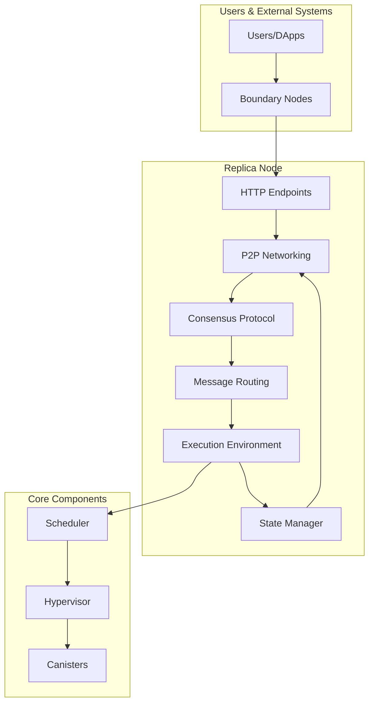
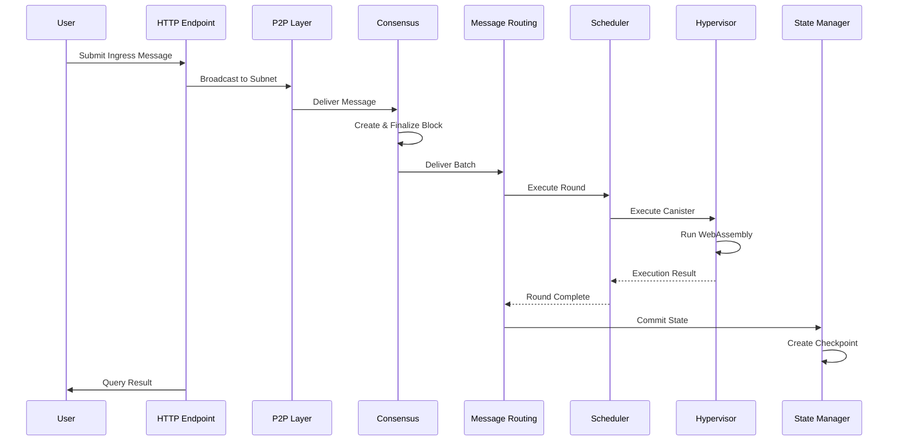

The Internet Computer (IC) is a decentralized blockchain network that extends the functionality of the public internet, allowing it to host backend software and services. This document provides a high-level overview of the IC's architecture.

## Core Architecture

The Internet Computer protocol is organized into four main layers, each responsible for specific functionality:

<CardGroup cols={2}>
  <Card title="Networking Layer" icon="network-wired" href="/architecture/networking">
    P2P communication, XNet messaging, and HTTP endpoints
  </Card>
  <Card title="Consensus Layer" icon="handshake" href="/architecture/consensus">
    Block creation, finalization, and distributed key generation
  </Card>
  <Card title="Execution Layer" icon="microchip" href="/architecture/execution-environment">
    Canister execution, WebAssembly runtime, and message routing
  </Card>
  <Card title="State Management" icon="database">
    State synchronization, checkpointing, and certification
  </Card>
</CardGroup>

## System Architecture Diagram



## Layer Breakdown

### Networking Layer

The networking layer handles all communication:

- **P2P Protocol**: Intra-subnet node communication using QUIC transport
- **XNet Messaging**: Cross-subnet communication via certified streams
- **HTTP Endpoints**: Public API for users and boundary nodes
- **State Synchronization**: Efficient state transfer between nodes

See [Networking Architecture](/architecture/networking) for details.

### Consensus Layer

The consensus layer ensures agreement on the state of the blockchain:

- **Block Maker**: Proposes new blocks with payloads
- **Notary**: Signs and notarizes valid blocks
- **Finalizer**: Finalizes blocks for execution
- **Random Beacon**: Provides verifiable randomness
- **DKG (Distributed Key Generation)**: Manages threshold cryptography
- **Catch-Up Package (CUP)**: Enables fast synchronization

See [Consensus Architecture](/architecture/consensus) for details.

### Execution Layer

The execution environment processes messages and executes canister code:

- **Message Routing**: Routes incoming and outgoing messages
- **Scheduler**: Manages canister execution rounds with fair scheduling
- **Hypervisor**: WebAssembly runtime with system API
- **Canister Manager**: Handles canister lifecycle and installation
- **Cycles Account Manager**: Manages computation cost accounting

See [Execution Environment](/architecture/execution-environment) for details.

### State Management Layer

The state manager maintains and synchronizes replicated state:

- **Checkpointing**: Periodic state snapshots for recovery
- **State Certification**: Cryptographic proofs of state validity
- **State Synchronization**: Efficient catch-up for slow nodes
- **Canonical State**: Deterministic state representation
- **Stream Encoding**: XNet stream management

The state manager is located in `rs/state_manager/`.

## Component Interaction Flow

The following diagram shows how components interact during typical request processing:



## Replica Node Structure

Each replica node in the IC runs the full protocol stack. The replica binary is built from `rs/replica/` and sets up all components:

<Steps>
  <Step title="Initialization">
    The replica initializes crypto components, registry client, and configuration from `rs/replica/src/setup_ic_stack.rs:60`
  </Step>
  
  <Step title="Component Setup">
    Core components are instantiated:
    - State Manager (`rs/state_manager/`)
    - Execution Environment (`rs/execution_environment/`)
    - Consensus (`rs/consensus/`)
    - Message Routing (`rs/messaging/`)
    - P2P Stack (`rs/p2p/`)
  </Step>
  
  <Step title="Service Start">
    All components start their background tasks and begin processing
  </Step>
</Steps>

## Key Design Principles

### Determinism

All replica nodes must reach identical states. The execution environment ensures deterministic execution through:
- Deterministic WebAssembly execution
- Controlled randomness via Random Beacon
- Precise instruction metering
- Fixed execution order

### Scalability

The IC scales through:
- **Subnets**: Independent blockchain instances
- **XNet Messaging**: Asynchronous cross-subnet communication
- **Parallel Execution**: Multi-threaded canister execution
- **State Sharding**: Distributed state across subnets

### Security

Security is maintained through:
- **Threshold Cryptography**: No single point of failure
- **Chain Key Technology**: Efficient signature verification
- **Sandboxing**: Isolated canister execution in `rs/canister_sandbox/`
- **Resource Limits**: Cycles-based cost model

### Performance

Performance optimizations include:
- **Compiled WebAssembly**: JIT compilation with caching
- **Efficient State Sync**: Incremental state transfer
- **Batched Execution**: Multiple messages per round
- **Parallel Consensus**: Concurrent block validation

## Source Code Organization

The implementation is organized in `rs/` (Rust crates):

```
rs/
├── replica/              # Main replica binary
├── consensus/            # Consensus protocol
├── execution_environment/ # Canister execution
├── messaging/            # Message routing
├── state_manager/        # State management
├── p2p/                  # P2P networking
├── http_endpoints/       # HTTP API
├── crypto/               # Cryptographic primitives
├── types/                # Core type definitions
├── interfaces/           # Component interfaces
└── ... (other crates)
```

## Next Steps

<CardGroup cols={2}>
  <Card title="Replica" icon="server" href="/architecture/replica">
    Learn about replica structure and lifecycle
  </Card>
  <Card title="Consensus" icon="handshake" href="/architecture/consensus">
    Deep dive into the consensus protocol
  </Card>
  <Card title="Execution" icon="microchip" href="/architecture/execution-environment">
    Understand canister execution
  </Card>
  <Card title="Networking" icon="network-wired" href="/architecture/networking">
    Explore P2P and XNet communication
  </Card>
</CardGroup>
