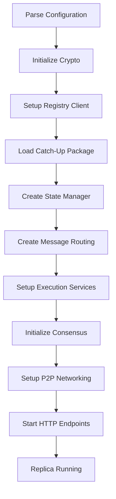
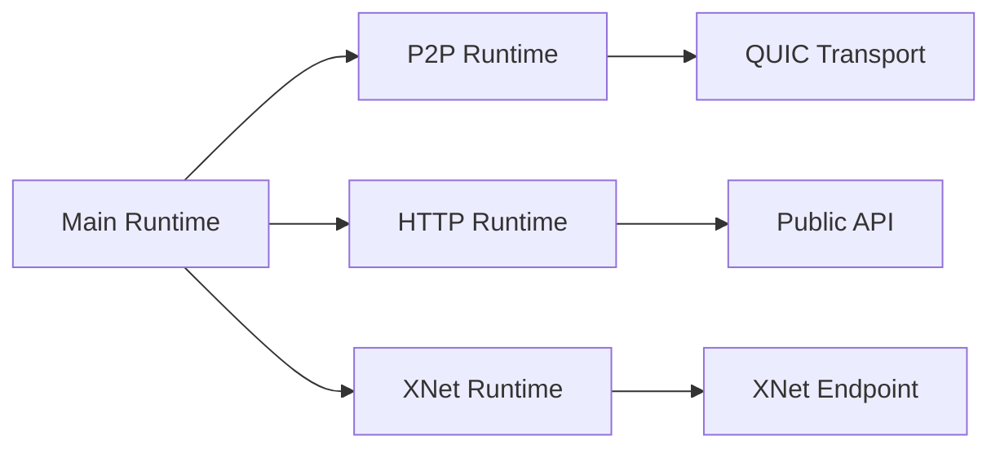

The replica is the core software component that runs on every node in the Internet Computer network. It implements the full protocol stack and is responsible for maintaining consensus, executing canisters, and managing state.

## Replica Overview

The replica binary is built from the `rs/replica/` directory and serves as the entry point for running an IC node. Each replica participates in:

- Consensus protocol execution
- Message routing and processing
- Canister code execution
- State management and synchronization
- P2P communication with other subnet nodes

## Source Code Structure

The replica implementation is located in `rs/replica/` with the following structure:

```
rs/replica/
├── src/
│   ├── lib.rs                 # Main library exports
│   ├── args.rs                # CLI argument parsing
│   ├── setup.rs               # Initial setup and configuration
│   └── setup_ic_stack.rs      # IC stack construction
├── bin/                        # Binary entry points
├── setup_ic_network/           # Network setup utilities
└── Cargo.toml                  # Dependency configuration
```

## IC Stack Construction

The replica constructs the full IC stack through the `construct_ic_stack` function located in `rs/replica/src/setup_ic_stack.rs:60`. This function orchestrates the creation and wiring of all major components.

### Component Initialization Order



### Key Parameters

The `construct_ic_stack` function accepts:

<ParamField path="log" type="ReplicaLogger">
  Logger instance for structured logging
</ParamField>

<ParamField path="metrics_registry" type="MetricsRegistry">
  Registry for Prometheus metrics collection
</ParamField>

<ParamField path="rt_handle_main" type="tokio::runtime::Handle">
  Main async runtime handle
</ParamField>

<ParamField path="rt_handle_p2p" type="tokio::runtime::Handle">
  Dedicated runtime for P2P operations
</ParamField>

<ParamField path="rt_handle_http" type="tokio::runtime::Handle">
  Dedicated runtime for HTTP endpoints
</ParamField>

<ParamField path="rt_handle_xnet" type="tokio::runtime::Handle">
  Dedicated runtime for XNet communication
</ParamField>

<ParamField path="config" type="Config">
  Full replica configuration
</ParamField>

<ParamField path="node_id" type="NodeId">
  Unique identifier for this node
</ParamField>

<ParamField path="subnet_id" type="SubnetId">
  Subnet this replica belongs to
</ParamField>

<ParamField path="registry" type="Arc<impl RegistryClient>">
  Registry client for network configuration
</ParamField>

<ParamField path="crypto" type="Arc<CryptoComponent>">
  Cryptographic component for signing and verification
</ParamField>

<ParamField path="catch_up_package" type="Option<pb::CatchUpPackage>">
  Initial CUP for synchronization (from orchestrator)
</ParamField>

## Major Components

### State Manager

The State Manager maintains the replicated state and handles:

- **State Persistence**: Checkpointing to disk
- **State Synchronization**: Efficient catch-up for lagging nodes  
- **State Certification**: Cryptographic proofs of state validity
- **Stream Management**: XNet stream encoding/decoding

```rust
// From rs/replica/src/setup_ic_stack.rs
use ic_state_manager::{StateManagerImpl, state_sync::StateSync};
```

Location: `rs/state_manager/`

### Message Routing

Message Routing coordinates message flow between consensus and execution:

- Receives batches from consensus
- Routes messages to appropriate canisters
- Manages input and output queues
- Handles XNet stream induction

```rust
// From rs/replica/src/setup_ic_stack.rs
use ic_messaging::MessageRoutingImpl;
```

Location: `rs/messaging/`

### Execution Services

The Execution Environment provides canister execution capabilities:

<Accordion title="Execution Services Components">
  - **Scheduler**: Manages fair execution across canisters
  - **Hypervisor**: WebAssembly runtime with system API
  - **Ingress Filter**: Validates incoming messages
  - **Query Handler**: Processes read-only queries
  - **Ingress History**: Tracks message status
</Accordion>

```rust
// From rs/replica/src/setup_ic_stack.rs
use ic_execution_environment::ExecutionServices;
```

Location: `rs/execution_environment/`

### Consensus and P2P

Consensus and P2P are set up together through a dedicated function:

```rust
// From rs/replica/src/setup_ic_stack.rs
use ic_replica_setup_ic_network::setup_consensus_and_p2p;
```

This creates:
- Consensus pool and validators
- P2P artifact manager
- Network transport layers
- DKG and threshold signature components

See [Consensus Architecture](/architecture/consensus) and [Networking Architecture](/architecture/networking).

### HTTP Endpoints

HTTP endpoints expose the IC API to external clients:

- **Public API**: Query, call, read_state endpoints
- **Metrics**: Prometheus metrics endpoint
- **Status**: Node health and version information
- **XNet Endpoint**: Cross-subnet communication endpoint

```rust
// From rs/replica/src/setup_ic_stack.rs
use ic_http_endpoints_xnet::XNetEndpoint;
```

Location: `rs/http_endpoints/`

## Replica Lifecycle

### 1. Startup

<Steps>
  <Step title="Parse Arguments">
    Parse command-line arguments and load configuration files
  </Step>
  
  <Step title="Initialize Crypto">
    Set up cryptographic components with node keys
  </Step>
  
  <Step title="Load Registry">
    Connect to NNS and sync registry state
  </Step>
  
  <Step title="Determine CUP">
    Load catch-up package from orchestrator or consensus pool
  </Step>
</Steps>

### 2. Component Setup

The replica creates components in dependency order:

```rust
// Consensus pool creation (rs/replica/src/setup_ic_stack.rs:48)
fn create_consensus_pool_dir(config: &Config) {
    std::fs::create_dir_all(&config.artifact_pool.consensus_pool_path)
        .unwrap_or_else(|err| {
            panic!(
                "Failed to create consensus pool directory {}: {}",
                config.artifact_pool.consensus_pool_path.display(),
                err
            )
        });
}
```

### 3. Runtime Execution

Once initialized, the replica runs continuously:

- **P2P Runtime**: Handles network communication
- **Consensus Runtime**: Produces and validates blocks
- **Execution Runtime**: Processes messages and executes canisters
- **HTTP Runtime**: Serves API requests

Each runtime operates independently on dedicated Tokio runtimes for isolation and performance.

### 4. Graceful Shutdown

Components provide `JoinGuard` handles that allow graceful shutdown:

```rust
// Return type from construct_ic_stack
// (rs/replica/src/setup_ic_stack.rs:74)
Vec<Box<dyn JoinGuard>>
```

## Configuration

The replica is configured through:

### Configuration File

A TOML/JSON configuration file specifies:
- Network endpoints and ports
- Artifact pool paths
- Execution environment settings
- Cryptographic key locations
- Feature flags

Location: `rs/config/`

### Registry

The NNS registry provides dynamic configuration:
- Subnet membership
- Consensus parameters
- Resource limits
- API boundary nodes

### Catch-Up Package

The CUP provides bootstrap state:

<Note>
  A CUP can be **signed** (created by subnet consensus) or **unsigned** (created by orchestrator during recovery/genesis). The replica validates and uses the CUP to initialize consensus.
</Note>

```rust
// From rs/replica/src/setup_ic_stack.rs:83
let (catch_up_package, catch_up_package_proto) = {
    match catch_up_package {
        Some(cup_proto_from_orchestrator) => {
            let cup_from_orchestrator = 
                CatchUpPackage::try_from(&cup_proto_from_orchestrator)
                    .expect("deserializing CUP failed");
            // ...
        }
    }
};
```

## Monitoring and Observability

### Metrics

The replica exposes Prometheus metrics for:
- Consensus progress and finalization
- Execution rounds and instruction counts
- State manager checkpoints
- P2P message statistics
- HTTP request latencies

Metrics are served on a dedicated HTTP endpoint.

### Logging

Structured logging using `slog` provides:
- Component-level log filtering
- Correlation IDs for request tracking
- Performance measurements
- Error and warning notifications

Logs are configured through `RUST_LOG` environment variable.

### Tracing

Distributed tracing support via `tokio-tracing` enables:
- Request flow visualization
- Performance profiling
- Bottleneck identification

```rust
// From rs/replica/src/setup_ic_stack.rs:73
tracing_handle: ReloadHandles
```

## Thread and Runtime Architecture

The replica uses multiple Tokio runtimes for isolation:



Benefits:
- **Isolation**: Blocking operations don't starve other tasks
- **Performance**: Dedicated resources per subsystem
- **Reliability**: Runtime failures are contained

Additionally, blocking operations use thread pools:
- State manager checkpoint threads: 16 threads (see `rs/state_manager/src/lib.rs:95`)
- Consensus payload validation pool
- Execution round thread pool

## Artifact Pools

The replica maintains several artifact pools:

### Consensus Pool

Stores consensus artifacts:
- Blocks
- Notarizations
- Finalizations
- Random beacons
- Random tapes
- Catch-up packages

Location: Configured via `artifact_pool.consensus_pool_path`

### DKG Pool

Stores DKG messages and dealings for distributed key generation.

### ECDSA Pool (iDKG)

Stores threshold ECDSA artifacts for chain key cryptography.

## Best Practices

<Warning>
  The replica must NEVER update git config or skip git hooks. All operations must be deterministic and auditable.
</Warning>

<Tip>
  When debugging replica issues, check logs with appropriate filtering:
  ```bash
  RUST_LOG=info,ic_consensus=debug,ic_execution_environment=debug
  ```
</Tip>

## Further Reading

<CardGroup cols={2}>
  <Card title="Consensus" icon="handshake" href="/architecture/consensus">
    Learn about the consensus protocol implementation
  </Card>
  <Card title="Execution" icon="microchip" href="/architecture/execution-environment">
    Understand canister execution
  </Card>
  <Card title="Networking" icon="network-wired" href="/architecture/networking">
    Explore P2P communication
  </Card>
  <Card title="Overview" icon="sitemap" href="/architecture/overview">
    Return to architecture overview
  </Card>
</CardGroup>
