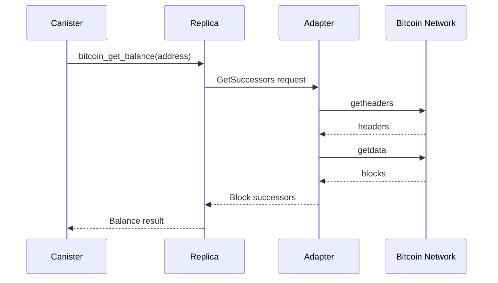

The Internet Computer provides native integration with the Bitcoin network, enabling canisters to interact directly with Bitcoin without trusted intermediaries. This integration allows canisters to hold, send, and receive Bitcoin through threshold ECDSA signatures.

## Architecture Overview

The Bitcoin integration consists of several key components:

- **Bitcoin Adapter**: Connects to the Bitcoin P2P network to fetch blocks and submit transactions
- **Bitcoin Client**: RPC client for communication between replicas and the Bitcoin adapter
- **Bitcoin Consensus**: Payload builder for including Bitcoin state in consensus
- **Bitcoin Canister API**: Management canister endpoints for Bitcoin operations

## Bitcoin Adapter

The Bitcoin adapter (`rs/bitcoin/adapter`) serves as the bridge between IC replicas and the Bitcoin P2P network.

### Key Responsibilities

<CardGroup cols={2}>
  <Card title="Block Synchronization" icon="cube">
    Downloads and validates blocks from Bitcoin peers
  </Card>
  <Card title="Transaction Broadcasting" icon="paper-plane">
    Submits signed transactions to the Bitcoin network
  </Card>
  <Card title="UTXO Management" icon="coins">
    Tracks unspent transaction outputs for canisters
  </Card>
  <Card title="Network Management" icon="network-wired">
    Manages connections to multiple Bitcoin nodes
  </Card>
</CardGroup>

### Core Components

#### Connection Manager

The connection manager handles multiple simultaneous connections to Bitcoin nodes:

```rust
// From rs/bitcoin/adapter/src/connectionmanager.rs
// Manages TCP and SOCKS connections to Bitcoin peers
// Handles version handshakes and peer selection
```

Key features:
- Maintains connections to multiple Bitcoin nodes
- Implements address book for peer discovery
- Handles connection lifecycle and reconnection logic

#### Blockchain Manager

The blockchain manager (`rs/bitcoin/adapter/src/blockchainmanager.rs`) coordinates block synchronization:

```rust
// Maximum number of headers in a single message
pub const MAX_HEADERS_SIZE: usize = 2_000;

// Processes headers, inv, and block messages from peers
// Validates blocks according to Bitcoin consensus rules
// Maintains local blockchain state
```

Responsibilities:
- Send `getheaders` and `getdata` messages to peers
- Process incoming `headers`, `inv`, and `block` messages
- Validate block headers and maintain blockchain state
- Serve block data to the Bitcoin canister

#### Blockchain State

The blockchain state (`rs/bitcoin/adapter/src/blockchainstate.rs`) maintains the adapter's view of the Bitcoin blockchain:

- Stores block headers and full blocks
- Validates incoming blocks against consensus rules
- Provides queries for block successors
- Caches recent blocks for efficient retrieval

### Adapter Configuration

The adapter supports multiple Bitcoin networks:

```rust
pub enum Network {
    Mainnet,
    Testnet,
    Regtest,
}
```

<Accordion title="Adapter Configuration Options">
From `rs/bitcoin/adapter/src/config.rs`:

- **network**: Bitcoin network (mainnet/testnet/regtest)
- **cache_dir**: Directory for storing blockchain data
- **idle_seconds**: Time before adapter becomes idle
- **incoming_source**: Source for incoming connections (SOCKS/TCP)
- **address_limits**: Connection limits per network

The adapter starts in idle mode and only syncs when the Bitcoin canister makes requests.
</Accordion>

## Bitcoin Client

The Bitcoin client (`rs/bitcoin/client`) provides the RPC interface between IC replicas and Bitcoin adapters.

### Client Architecture

```rust
// From rs/bitcoin/client/src/lib.rs
pub struct BitcoinAdapterClients {
    pub btc_testnet_client: AdapterClient,
    pub btc_mainnet_client: AdapterClient,
    pub doge_testnet_client: AdapterClient,
    pub doge_mainnet_client: AdapterClient,
}
```

The client supports multiple networks simultaneously, allowing subnets to interact with different Bitcoin networks.

### Request Types

<Tabs>
  <Tab title="GetSuccessors">
    Retrieves block successors starting from an anchor block:
    
    ```rust
    GetSuccessorsRequest {
        anchor: Vec<u8>,           // Starting block hash
        processed_block_hashes: Vec<Vec<u8>>,  // Already known blocks
    }
    ```
    
    Returns blocks in breadth-first order for security.
  </Tab>
  <Tab title="SendTransaction">
    Broadcasts a signed Bitcoin transaction:
    
    ```rust
    SendTransactionRequest {
        transaction: Vec<u8>,  // Raw Bitcoin transaction
    }
    ```
    
    Submits the transaction to the Bitcoin P2P network.
  </Tab>
</Tabs>

### Communication Protocol

The client uses gRPC over Unix Domain Sockets (UDS) for efficient local communication:

- **Protocol**: gRPC with Protocol Buffers
- **Transport**: Unix Domain Sockets
- **Timeouts**: Configurable per-request timeouts
- **Metrics**: Built-in request/response tracking

## Bitcoin Consensus

The Bitcoin consensus component (`rs/bitcoin/consensus`) integrates Bitcoin state into IC consensus.

### Payload Builder

```rust
// From rs/bitcoin/consensus/src/payload_builder.rs
pub struct BitcoinPayloadBuilder;
```

The payload builder:
- Creates Bitcoin payloads for consensus blocks
- Ensures Bitcoin state is agreed upon by all replicas
- Coordinates with the Bitcoin adapter for fresh data

## Network Support

<Info>
The Bitcoin integration supports both Bitcoin and Dogecoin networks through the same adapter architecture.
</Info>

### Supported Networks

| Network | Purpose | Adapter Configuration |
|---------|---------|----------------------|
| Bitcoin Mainnet | Production Bitcoin transactions | `AdapterNetwork::Bitcoin(Mainnet)` |
| Bitcoin Testnet | Testing with testnet BTC | `AdapterNetwork::Bitcoin(Testnet)` |
| Bitcoin Regtest | Local development | `AdapterNetwork::Bitcoin(Regtest)` |
| Dogecoin Mainnet | Production Dogecoin transactions | `AdapterNetwork::Dogecoin(Mainnet)` |
| Dogecoin Testnet | Testing with testnet DOGE | `AdapterNetwork::Dogecoin(Testnet)` |

## Integration Flow



## Security Considerations

<Warning>
The adapter implements several security measures to protect against malicious Bitcoin nodes:
</Warning>

- **Block validation**: All blocks are validated according to Bitcoin consensus rules
- **Header validation**: Block headers are checked for valid proof-of-work
- **BFS ordering**: Block successors are returned in breadth-first order to prevent fork manipulation
- **Connection limits**: Limits on connections per peer to prevent resource exhaustion
- **Transaction validation**: Validates transaction format before broadcasting

## Performance Optimizations

### Block Caching

The adapter maintains caches for efficient block retrieval:

- **Header Cache**: Recently received block headers
- **Block Cache**: Full blocks ready to serve to replicas
- **Transaction Store**: Pending transactions awaiting broadcast

### Idle Mode

The adapter enters idle mode when not actively serving requests:

```rust
// From rs/bitcoin/adapter/src/lib.rs
pub struct AdapterState {
    idle_seconds: u64,
    last_received_rx: watch::Receiver<Option<Instant>>,
}
```

This saves resources on subnets that don't actively use Bitcoin integration.

## Related APIs

<CardGroup cols={2}>
  <Card title="Management Canister API" icon="code" href="/core/canisters">
    Bitcoin APIs available to canisters
  </Card>
  <Card title="ckBTC Integration" icon="bitcoin" href="/chain-integration/ckbtc">
    Chain-key Bitcoin token
  </Card>
</CardGroup>

## Source Code Reference

Key files in the Bitcoin integration:

- `rs/bitcoin/adapter/src/lib.rs` - Main adapter entry point
- `rs/bitcoin/adapter/src/blockchainmanager.rs` - Block synchronization logic  
- `rs/bitcoin/adapter/src/blockchainstate.rs` - Blockchain state management
- `rs/bitcoin/adapter/src/connectionmanager.rs` - Peer connection handling
- `rs/bitcoin/client/src/lib.rs` - RPC client implementation
- `rs/bitcoin/consensus/src/payload_builder.rs` - Consensus integration
