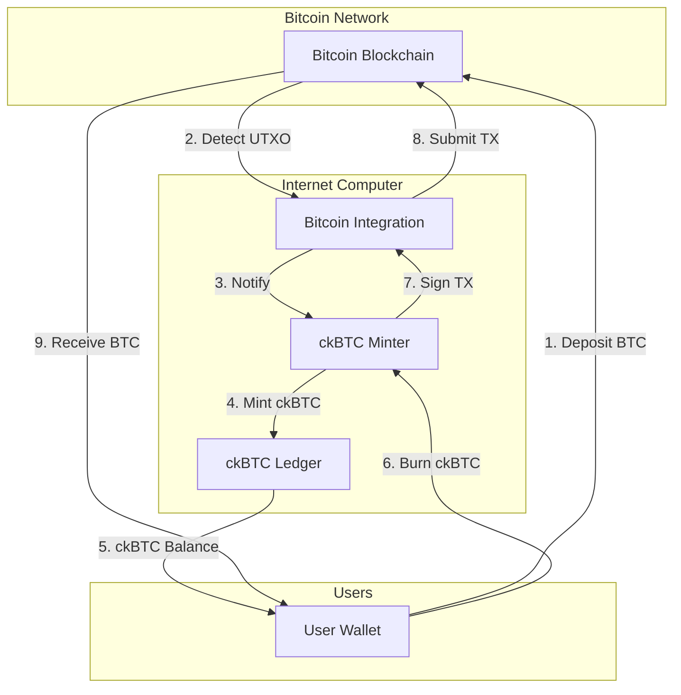

ckBTC (chain-key Bitcoin) is an ICRC-1 token on the Internet Computer that is backed 1:1 by Bitcoin held by a canister smart contract. The ckBTC minter canister manages the conversion between BTC and ckBTC, enabling users to interact with Bitcoin through the speed and low cost of the Internet Computer.

## Overview

ckBTC combines the value of Bitcoin with the programmability and efficiency of the Internet Computer:

- **1:1 Backed**: Every ckBTC token is backed by real BTC held in the minter's custody
- **Fast Transactions**: ckBTC transfers finalize in 1-2 seconds
- **Low Fees**: Transaction fees are ~0.0000001 BTC compared to on-chain Bitcoin fees
- **Programmable**: Can be used in canister smart contracts and DeFi applications

## Architecture



## Minter Canister

The ckBTC minter (`rs/bitcoin/ckbtc/minter`) is the core component managing conversions between BTC and ckBTC.

### Key Responsibilities

<CardGroup cols={2}>
  <Card title="BTC → ckBTC" icon="right-to-bracket">
    Detects Bitcoin deposits and mints ckBTC tokens
  </Card>
  <Card title="ckBTC → BTC" icon="right-from-bracket">
    Burns ckBTC and sends Bitcoin to destination addresses
  </Card>
  <Card title="UTXO Management" icon="database">
    Tracks and manages Bitcoin UTXOs owned by the minter
  </Card>
  <Card title="Fee Estimation" icon="calculator">
    Estimates Bitcoin transaction fees dynamically
  </Card>
</CardGroup>

### Minter Configuration

```rust
// From rs/bitcoin/ckbtc/minter/ckbtc_minter.did
type InitArgs = record {
    btc_network : BtcNetwork;
    ledger_id : principal;
    ecdsa_key_name : text;
    deposit_btc_min_amount : opt nat64;
    retrieve_btc_min_amount : nat64;
    max_time_in_queue_nanos : nat64;
    min_confirmations : opt nat32;
    mode : Mode;
    check_fee : opt nat64;
    btc_checker_principal: opt principal;
};
```

<Accordion title="Configuration Parameters">
- **btc_network**: Bitcoin network (Mainnet/Testnet/Regtest)
- **ledger_id**: Principal of the ckBTC ledger canister
- **ecdsa_key_name**: Name of the threshold ECDSA key to use
- **deposit_btc_min_amount**: Minimum BTC amount for deposits (prevents dust)
- **retrieve_btc_min_amount**: Minimum ckBTC amount for withdrawals
- **max_time_in_queue_nanos**: Maximum time a withdrawal can be queued
- **min_confirmations**: Required confirmations for Bitcoin transactions (default: 12)
- **mode**: Operation mode (ReadOnly/RestrictedTo/GeneralAvailability)
- **check_fee**: Fee charged for Bitcoin address validation
- **btc_checker_principal**: Optional KYC/AML checker canister
</Accordion>

## BTC to ckBTC (Deposit)

Users deposit Bitcoin to a unique address controlled by the minter to receive ckBTC.

### Deposit Process

<Steps>
  <Step title="Get Bitcoin Address">
    Call `get_btc_address` to obtain a unique Bitcoin address:
    
    ```candid
    get_btc_address : (record { 
        owner: opt principal; 
        subaccount : opt blob 
    }) -> (text);
    ```
    
    Each IC account (principal + subaccount) maps to a unique Bitcoin address.
  </Step>
  
  <Step title="Send Bitcoin">
    Transfer BTC from your Bitcoin wallet to the address from step 1.
    
    <Warning>
    Send at least the minimum deposit amount (check `deposit_btc_min_amount` in `get_minter_info`).
    </Warning>
  </Step>
  
  <Step title="Wait for Confirmations">
    Wait for the required number of confirmations (typically 12 blocks, ~2 hours).
  </Step>
  
  <Step title="Update Balance">
    Call `update_balance` to trigger minting:
    
    ```candid
    update_balance : (record { 
        owner: opt principal; 
        subaccount : opt blob 
    }) -> (variant { 
        Ok : vec UtxoStatus; 
        Err : UpdateBalanceError 
    });
    ```
    
    The minter will mint ckBTC (minus fees) to your IC account.
  </Step>
</Steps>

### UTXO Processing

The minter processes UTXOs in several states:

```rust
// From rs/bitcoin/ckbtc/minter/ckbtc_minter.did
type UtxoStatus = variant {
    ValueTooSmall : Utxo;
    Tainted : Utxo;
    Checked : Utxo;
    Minted : record {
        block_index : nat64;
        minted_amount : nat64;
        utxo : Utxo;
    };
};
```

<Accordion title="UTXO Status Meanings">
- **ValueTooSmall**: UTXO value is below the minimum deposit amount
- **Tainted**: UTXO flagged by the Bitcoin checker (KYC/AML)
- **Checked**: UTXO passed checks but minting not yet complete
- **Minted**: ckBTC successfully minted, includes ledger block index
</Accordion>

## ckBTC to BTC (Withdrawal)

Users burn ckBTC to receive Bitcoin at a specified address.

### Withdrawal Process

<Steps>
  <Step title="Approve Minter">
    First-time withdrawals require approving the minter on the ledger:
    
    ```candid
    icrc2_approve : (record {
        spender : record { owner : principal };
        amount : nat;
    }) -> (variant { Ok : nat; Err : ApproveError });
    ```
  </Step>
  
  <Step title="Request Withdrawal">
    Call `retrieve_btc_with_approval` to initiate withdrawal:
    
    ```candid
    retrieve_btc_with_approval : (record {
        address : text;
        amount : nat64;
        from_subaccount : opt blob;
    }) -> (variant { 
        Ok : RetrieveBtcOk; 
        Err : RetrieveBtcWithApprovalError 
    });
    ```
    
    Returns a `block_index` for tracking the withdrawal.
  </Step>
  
  <Step title="Track Status">
    Monitor withdrawal progress:
    
    ```candid
    retrieve_btc_status_v2 : (record { 
        block_index : nat64 
    }) -> (RetrieveBtcStatusV2) query;
    ```
  </Step>
</Steps>

### Withdrawal States

```rust
type RetrieveBtcStatusV2 = variant {
    Unknown;
    Pending;
    Signing;
    Sending : record { txid : blob };
    Submitted : record { txid : blob };
    AmountTooLow;
    Confirmed : record { txid : blob };
    Reimbursed : ReimbursedDeposit;
    WillReimburse : ReimbursementRequest;
};
```

<Accordion title="Withdrawal Status Flow">
1. **Pending**: Request queued, waiting to be batched
2. **Signing**: Obtaining threshold ECDSA signature
3. **Sending**: Signed transaction being broadcast
4. **Submitted**: Transaction submitted to Bitcoin network
5. **Confirmed**: Transaction confirmed on Bitcoin blockchain
6. **Reimbursed**: Failed transaction, ckBTC refunded
</Accordion>

### Transaction Batching

```rust
// From rs/bitcoin/ckbtc/minter/src/lib.rs
pub const MIN_PENDING_REQUESTS: usize = 20;
pub const MAX_REQUESTS_PER_BATCH: usize = 100;
```

The minter batches withdrawal requests to optimize Bitcoin transaction fees:

- Waits for at least 20 pending requests before creating a batch
- Includes up to 100 requests in a single Bitcoin transaction
- Distributes transaction fees across all recipients
- Creates change outputs back to the minter

## UTXO Management

The minter maintains a pool of UTXOs for efficient transaction construction.

### UTXO Selection Algorithm

```rust
// From rs/bitcoin/ckbtc/minter/src/lib.rs
fn utxos_selection(
    target: u64, 
    available_utxos: &mut UtxoSet, 
    output_count: usize
) -> Vec<Utxo>
```

The selection algorithm:
1. Greedily selects smallest UTXOs that sum to at least the target amount
2. If managing >1,000 UTXOs, matches input count to output count + 1
3. Returns empty vector if insufficient funds

### UTXO Consolidation

```rust
pub const MIN_CONSOLIDATION_INTERVAL: Duration = Duration::from_secs(24 * 60 * 60);
pub const UTXOS_COUNT_THRESHOLD: usize = 1_000;
```

The minter automatically consolidates UTXOs when:
- UTXO count exceeds the threshold
- At least 24 hours have passed since last consolidation
- Bitcoin network fees are reasonable

<Info>
Consolidation reduces future transaction fees by combining many small UTXOs into fewer large ones.
</Info>

## Fee Structure

### Deposit Fees

When converting BTC → ckBTC:

```rust
pub const CKBTC_LEDGER_MEMO_SIZE: u16 = 80;
```

- **Bitcoin Transaction Fee**: Paid by the user when sending BTC
- **Check Fee**: Optional fee for KYC/AML validation (if enabled)
- **Ledger Fee**: 10 satoshis for minting ckBTC

### Withdrawal Fees

When converting ckBTC → BTC:

```candid
type WithdrawalFee = record {
    minter_fee : nat64;     // Fee charged by minter
    bitcoin_fee : nat64;    // Estimated Bitcoin network fee
};
```

Estimate withdrawal fees:

```candid
estimate_withdrawal_fee : (record { 
    amount : opt nat64 
}) -> (record { 
    bitcoin_fee : nat64; 
    minter_fee : nat64 
}) query;
```

The minter dynamically estimates fees based on:
- Current Bitcoin network fee rate (from Bitcoin canister)
- Transaction size (inputs + outputs)
- Required confirmations

### Fee Distribution

```rust
// From rs/bitcoin/ckbtc/minter/src/lib.rs
fn distribute(amount: u64, n: u64) -> Vec<u64>
```

For batched transactions, fees are distributed fairly:
- Each recipient pays a proportional share
- Remainder distributed to early recipients
- Example: distribute(5 satoshis, 3 recipients) = [2, 2, 1]

## Transaction Building

The minter constructs Bitcoin transactions with multiple outputs.

### Unsigned Transaction

```rust
pub struct UnsignedTransaction {
    inputs: Vec<UnsignedInput>,
    outputs: Vec<TxOut>,
    lock_time: u32,
}
```

### Transaction Features

<Tabs>
  <Tab title="RBF Enabled">
    Replace-By-Fee (RBF) allows resubmitting with higher fees:
    
    ```rust
    const SEQUENCE_RBF_ENABLED: u32 = 0xfffffffd;
    ```
    
    Used when transactions get stuck in the mempool.
  </Tab>
  
  <Tab title="Change Outputs">
    All transactions include a change output back to the minter:
    
    ```rust
    pub struct ChangeOutput {
        vout: u32,    // Output index
        value: u64,   // Amount in satoshis
    }
    ```
    
    The change output absorbs:
    - Excess input value
    - Minter fees
  </Tab>
  
  <Tab title="Fee Estimation">
    Fees calculated based on transaction weight:
    
    ```rust
    fn evaluate_transaction_fee(
        tx: &UnsignedTransaction,
        fee_rate: FeeRate
    ) -> u64
    ```
    
    Uses fake signatures to estimate final transaction size.
  </Tab>
</Tabs>

### Transaction Resubmission

```rust
pub const MIN_RESUBMISSION_DELAY: Duration = Duration::from_secs(24 * 60 * 60);
```

If a transaction doesn't confirm within expected time:
1. Wait at least 24 hours
2. Check if transaction is in mempool (0 confirmations)
3. Create replacement transaction with higher fee
4. Increase fee by at least 10% from previous attempt
5. Resubmit to Bitcoin network

## Security Features

<Warning>
The ckBTC minter implements multiple security measures to protect user funds:
</Warning>

### Address Validation

```rust
pub enum BtcAddressCheckStatus {
    Valid,
    Invalid(String),
}
```

Withdrawal addresses are validated for:
- Correct format (P2PKH, P2SH, P2WPKH, P2WSH, P2TR)
- Network compatibility (mainnet vs testnet)
- Optional KYC/AML screening via Bitcoin checker

### Transaction Limits

```rust
const MAX_INPUTS_PER_TX: usize = 500;
```

- **Maximum inputs**: Prevents creating non-standard transactions >100KB
- **Minimum withdrawal**: Ensures amount covers Bitcoin transaction fees
- **Dust limit**: Prevents outputs too small for the Bitcoin network

### Reimbursement System

Failed transactions are automatically reimbursed:

```rust
type ReimbursementReason = variant {
    CallFailed;
    TaintedDestination : record {
        kyt_fee : nat64;
        kyt_provider: principal;
    };
};
```

Reimbursements occur when:
- Bitcoin checker rejects the destination address
- Transaction building fails (e.g., too many inputs)
- Ledger calls fail during processing

## Event Logging

The minter maintains a comprehensive event log for auditability.

### Event Types

```candid
type EventType = variant {
    init : InitArgs;
    upgrade : UpgradeArgs;
    received_utxos : record { /* ... */ };
    accepted_retrieve_btc_request : record { /* ... */ };
    sent_transaction : record { /* ... */ };
    confirmed_transaction : record { txid : blob };
    checked_utxo : record { /* ... */ };
    schedule_deposit_reimbursement : record { /* ... */ };
    reimbursed_failed_deposit : record { /* ... */ };
    // ... more event types
};
```

### Querying Events

```candid
get_events : (record { 
    start: nat64; 
    length : nat64 
}) -> (vec Event) query;
```

Events provide full transparency into minter operations.

## Candid Interface

### Core Methods

<Tabs>
  <Tab title="Deposit">
    ```candid
    // Get deposit address
    get_btc_address : (
        record { 
            owner: opt principal; 
            subaccount : opt blob 
        }
    ) -> (text);
    
    // Mint ckBTC from Bitcoin deposit
    update_balance : (
        record { 
            owner: opt principal; 
            subaccount : opt blob 
        }
    ) -> (variant { 
        Ok : vec UtxoStatus; 
        Err : UpdateBalanceError 
    });
    ```
  </Tab>
  
  <Tab title="Withdraw">
    ```candid
    // Estimate fees
    estimate_withdrawal_fee : (
        record { amount : opt nat64 }
    ) -> (record { 
        bitcoin_fee : nat64; 
        minter_fee : nat64 
    }) query;
    
    // Request withdrawal
    retrieve_btc_with_approval : (
        record {
            address : text;
            amount : nat64;
            from_subaccount : opt blob;
        }
    ) -> (variant { 
        Ok : RetrieveBtcOk; 
        Err : RetrieveBtcWithApprovalError 
    });
    
    // Check withdrawal status
    retrieve_btc_status_v2 : (
        record { block_index : nat64 }
    ) -> (RetrieveBtcStatusV2) query;
    ```
  </Tab>
  
  <Tab title="Info">
    ```candid
    // Get minter configuration
    get_minter_info : () -> (MinterInfo) query;
    
    // Get known UTXOs
    get_known_utxos: (
        record { 
            owner: opt principal; 
            subaccount : opt blob 
        }
    ) -> (vec Utxo) query;
    
    // Get event log
    get_events : (
        record { start: nat64; length : nat64 }
    ) -> (vec Event) query;
    ```
  </Tab>
</Tabs>

## Related Components

<CardGroup cols={2}>
  <Card title="Bitcoin Integration" icon="bitcoin" href="/chain-integration/bitcoin">
    Underlying Bitcoin protocol integration
  </Card>
  <Card title="ICRC-1 Ledger" icon="book" href="/packages/icrc-ledger">
    ckBTC implements the ICRC-1 token standard
  </Card>
</CardGroup>

## Source Code Reference

Key files in the ckBTC implementation:

- `rs/bitcoin/ckbtc/minter/src/lib.rs` - Main minter logic
- `rs/bitcoin/ckbtc/minter/src/state/` - State management
- `rs/bitcoin/ckbtc/minter/src/updates/` - Update call handlers
- `rs/bitcoin/ckbtc/minter/src/queries/` - Query call handlers
- `rs/bitcoin/ckbtc/minter/src/tx.rs` - Transaction building
- `rs/bitcoin/ckbtc/minter/ckbtc_minter.did` - Candid interface
