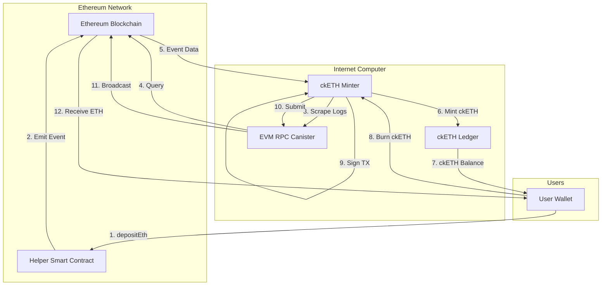

ckETH (chain-key Ethereum) is an ICRC-1 token on the Internet Computer that is backed 1:1 by Ethereum held by a canister smart contract. The ckETH minter canister manages the conversion between ETH and ckETH using threshold ECDSA signatures and Ethereum smart contract integration.

## Overview

ckETH brings Ethereum assets to the Internet Computer with the following benefits:

- **1:1 Backed**: Every ckETH token is backed by real ETH held in the minter's custody
- **Fast Finality**: ckETH transfers finalize in 1-2 seconds
- **Low Fees**: Transaction fees are ~0.000002 ETH vs. variable Ethereum gas fees
- **ERC-20 Support**: Also supports ckERC20 tokens for popular ERC-20s

<Info>
ckETH is available on both Ethereum Mainnet and Sepolia testnet. Use Sepolia for testing without risking real ETH.
</Info>

## Architecture



## Minter Canister

The ckETH minter (`rs/ethereum/cketh/minter`) manages the bidirectional conversion between ETH and ckETH.

### Key Responsibilities

<CardGroup cols={2}>
  <Card title="Event Scraping" icon="list">
    Continuously scrapes Ethereum logs for deposits
  </Card>
  <Card title="ETH → ckETH" icon="right-to-bracket">
    Mints ckETH when ETH deposits are detected
  </Card>
  <Card title="ckETH → ETH" icon="right-from-bracket">
    Burns ckETH and sends ETH to destination
  </Card>
  <Card title="Gas Management" icon="gas-pump">
    Dynamically estimates and manages gas fees
  </Card>
</CardGroup>

### Minter Configuration

```rust
// From rs/ethereum/cketh/minter/cketh_minter.did
type InitArg = record {
    ethereum_network : EthereumNetwork;
    ecdsa_key_name : text;
    ethereum_contract_address : opt text;
    ledger_id : principal;
    ethereum_block_height: BlockTag;
    minimum_withdrawal_amount : nat;
    next_transaction_nonce : nat;
    last_scraped_block_number : nat;
    evm_rpc_id : opt principal;
};
```

<Accordion title="Configuration Parameters">
- **ethereum_network**: Network (Mainnet or Sepolia)
- **ecdsa_key_name**: Threshold ECDSA key for signing transactions
- **ethereum_contract_address**: Address of the helper smart contract
- **ledger_id**: Principal of the ckETH ledger canister
- **ethereum_block_height**: Block tag to query (Latest/Safe/Finalized)
- **minimum_withdrawal_amount**: Minimum ETH for withdrawals (default: 30000000000000000 wei = 0.03 ETH)
- **next_transaction_nonce**: Nonce for the next outgoing transaction
- **last_scraped_block_number**: Starting block for log scraping
- **evm_rpc_id**: Optional EVM RPC canister principal (uses default if not set)
</Accordion>

## ETH to ckETH (Deposit)

Users deposit ETH via the helper smart contract to receive ckETH on the IC.

### Deposit Flow

<Steps>
  <Step title="Convert Principal to Bytes32">
    Convert your IC principal to a bytes32 format for the smart contract.
    
    Use the [minter dashboard](https://sv3dd-oaaaa-aaaar-qacoa-cai.raw.icp0.io/dashboard) or the `principal-to-hex` utility:
    
    ```bash
    # Get your principal
    dfx identity get-principal
    
    # Convert to hex
    cargo run --bin cketh-principal-to-hex $(dfx identity get-principal)
    ```
  </Step>
  
  <Step title="Call Helper Contract">
    Call the `depositEth` function on the helper contract:
    
    **Mainnet**: `0x18901044688D3756C35Ed2b36D93e6a5B8e00E68`
    
    **Sepolia**: `0x2D39863d30716aaf2B7fFFd85Dd03Dda2BFC2E38`
    
    ```solidity
    function depositEth(
        uint256 amount,
        bytes32 principal,
        bytes32 subaccount
    ) external payable
    ```
    
    Parameters:
    - `amount`: Amount of ETH to deposit (in wei)
    - `principal`: Your IC principal as bytes32
    - `subaccount`: IC subaccount (use `0x` for default)
    
    <Warning>
    Double-check your principal conversion. Incorrect encoding will result in lost funds.
    </Warning>
  </Step>
  
  <Step title="Wait for Finalization">
    Wait ~20 minutes for:
    - Ethereum transaction to finalize
    - Minter to scrape the event log
    - ckETH to be minted to your IC account
  </Step>
  
  <Step title="Check Balance">
    Verify your ckETH balance:
    
    ```bash
    dfx canister --network ic call ledger icrc1_balance_of \
      'record {owner = principal "'$(dfx identity get-principal)'" }'
    ```
  </Step>
</Steps>

### Helper Contract Events

The helper contract emits events that the minter scrapes:

```solidity
event ReceivedEth(
    address indexed from,
    uint256 value,
    bytes32 indexed principal,
    bytes32 indexed subaccount
);
```

The minter processes these events to mint ckETH:

```rust
// From rs/ethereum/cketh/minter/src/lib.rs
pub const SCRAPING_ETH_LOGS_INTERVAL: Duration = Duration::from_secs(3 * 60);
```

Logs are scraped every 3 minutes.

## ckETH to ETH (Withdrawal)

Users burn ckETH to receive ETH at an Ethereum address.

### Withdrawal Flow

<Steps>
  <Step title="Approve Minter">
    First-time users must approve the minter to spend ckETH:
    
    ```bash
    dfx canister --network ic call ledger icrc2_approve \
      "(record { \
        spender = record { \
          owner = principal \"$(dfx canister id minter --network ic)\" \
        }; \
        amount = 1_000_000_000_000_000_000 \
      })"
    ```
    
    This approves 1 ETH worth of withdrawals.
  </Step>
  
  <Step title="Request Withdrawal">
    Call `withdraw_eth` with destination address and amount:
    
    ```bash
    dfx canister --network ic call minter withdraw_eth \
      "(record { \
        amount = 150_000_000_000_000_000; \
        recipient = \"0xYOUR_ETH_ADDRESS\" \
      })"
    ```
    
    <Info>
    Amounts are in wei (1 ETH = 1,000,000,000,000,000,000 wei). Use [this converter](https://eth-converter.com/) to convert.
    </Info>
  </Step>
  
  <Step title="Track Progress">
    Monitor withdrawal status:
    
    ```bash
    dfx canister --network ic call minter withdrawal_status \
      "(record { withdrawal_id = BLOCK_INDEX })"
    ```
  </Step>
  
  <Step title="Receive ETH">
    Within ~6 minutes, the transaction is broadcast to Ethereum.
    
    ETH arrives at your address after transaction confirmation.
  </Step>
</Steps>

### Withdrawal States

```rust
type RetrieveEthStatus = variant {
    NotFound;          // Withdrawal request not found
    Pending;           // Waiting to be processed
    TxCreated;         // Transaction created but not signed
    TxSent : EthTransaction;  // Sent to Ethereum network
    TxFinalized : TxFinalizedStatus;  // Confirmed on Ethereum
};
```

<Accordion title="Transaction Finalization States">
```rust
type TxFinalizedStatus = variant {
    Success : record {
        transaction_hash : text;
        effective_transaction_fee: opt nat;
    };
    Reimbursed : record {
        transaction_hash : text;
        reimbursed_amount : nat;
        reimbursed_in_block : nat;
    };
    PendingReimbursement : EthTransaction;
};
```

- **Success**: Transaction confirmed successfully
- **Reimbursed**: Transaction failed, ckETH refunded
- **PendingReimbursement**: Transaction failed, reimbursement in progress
</Accordion>

## Fee Structure

### Deposit Fees

When converting ETH → ckETH:

- **Ethereum Gas Fee**: Paid when calling helper contract (~0.002 ETH typical)
- **Minting Fee**: No additional fee for minting ckETH

### Withdrawal Fees

When converting ckETH → ETH, users pay gas fees:

```rust
type Eip1559TransactionPrice = record {
    gas_limit : nat;                    // Maximum gas units
    max_fee_per_gas : nat;              // Maximum wei per gas
    max_priority_fee_per_gas : nat;     // Miner tip per gas
    max_transaction_fee : nat;          // Total max fee
    timestamp : opt nat64;              // Estimate timestamp
};
```

#### Fee Calculation

Estimate withdrawal fees:

```candid
eip1559_withdrawal_transaction_price : (
    opt Eip1559TransactionPriceArg
) -> (Eip1559TransactionPrice) query;
```

The minter estimates:
- **Gas Limit**: 21,000 for ETH transfers
- **Max Fee Per Gas**: Based on current network conditions
- **Priority Fee**: Miner incentive to include transaction

<Info>
**Important**: The withdrawal amount you receive is `withdrawal_amount - max_transaction_fee`. The actual cost may be lower if gas prices drop, with the difference kept by the minter to cover operational costs.
</Info>

#### Fee Example

From the ckETH documentation, here's a real withdrawal:

```
Withdrawal Amount: 39,998,000,000,000,000 wei (0.0399 ETH)
Gas Limit: 21,000
Max Fee Per Gas: 86,815,552,328 wei
Max TX Fee: 1,823,126,598,888,000 wei (0.0018 ETH)
Received at Destination: 38,174,873,401,112,000 wei (0.0381 ETH)

Actual Gas Price: 42,828,524,488 wei
Actual TX Fee: 899,399,014,248,000 wei (0.0009 ETH)
Unspent Fee: 923,727,584,640,000 wei (0.0009 ETH)
```

### Transfer Fees

ckETH transfers on the IC:

- **Transfer Fee**: 0.000002 ckETH (2,000,000,000,000 wei)
- **Approval Fee**: 0.000002 ckETH (2,000,000,000,000 wei)

These fees are set in the ledger configuration.

## Gas Fee Management

The minter dynamically manages Ethereum gas fees.

### Fee Estimation

```rust
// From rs/ethereum/cketh/minter/src/lib.rs
pub const PROCESS_ETH_RETRIEVE_TRANSACTIONS_INTERVAL: Duration = 
    Duration::from_secs(6 * 60);
```

Every 6 minutes, the minter:
1. Queries EVM RPC for current gas prices
2. Estimates max fee and priority fee
3. Updates internal fee estimates
4. Processes pending withdrawals

### EIP-1559 Pricing

ckETH uses EIP-1559 transaction pricing:

```rust
struct Eip1559Transaction {
    chain_id: u64,
    nonce: u64,
    max_priority_fee_per_gas: u128,  // Miner tip
    max_fee_per_gas: u128,           // Total max fee
    gas_limit: u64,
    to: [u8; 20],
    value: u128,
    data: Vec<u8>,
}
```

Benefits:
- More predictable fees than legacy transactions
- Automatic adjustment to network conditions
- Priority fee incentivizes faster inclusion

### Fee Caching

```rust
type GasFeeEstimate = record {
    max_fee_per_gas : nat;
    max_priority_fee_per_gas : nat;
    timestamp: nat64;
};
```

The minter caches recent gas estimates:
- Reduces RPC calls during withdrawal processing
- Provides stable estimates for users
- Updates every 6 minutes

## Transaction Management

The minter manages Ethereum transaction lifecycle and nonces.

### Nonce Tracking

Each Ethereum account has a sequential nonce:

```rust
// Initialized during deployment
next_transaction_nonce : nat
```

The minter:
- Increments nonce for each sent transaction
- Tracks pending transactions by nonce
- Detects and handles nonce gaps
- Supports manual nonce override via upgrades

### Transaction Resubmission

If a transaction is stuck:

<Steps>
  <Step title="Detection">
    Minter detects transaction hasn't been mined within expected time
  </Step>
  <Step title="Fee Increase">
    Creates new transaction with same nonce but 10% higher gas fees
  </Step>
  <Step title="Resubmission">
    Broadcasts replacement transaction to network
  </Step>
  <Step title="Confirmation">
    Either original or replacement transaction confirms
  </Step>
</Steps>

## ckERC20 Support

The ckETH minter also supports ERC-20 tokens through ckERC20 tokens.

### Ledger Suite Orchestrator

The orchestrator (`rs/ethereum/ledger-suite-orchestrator`) manages ckERC20 ledgers:

- Creates new ledger/archive/index canisters for each supported ERC-20
- Handles lifecycle management
- Coordinates with minter for deposits/withdrawals

### Supported Tokens

Query supported tokens:

```candid
get_minter_info : () -> (MinterInfo) query;

type MinterInfo = record {
    supported_ckerc20_tokens: opt vec CkErc20Token;
    // ... other fields
};

type CkErc20Token = record {
    ckerc20_token_symbol: text;
    erc20_contract_address: text;
    ledger_canister_id: principal;
};
```

### ERC-20 Deposit Flow

Similar to ETH deposits but using the ERC-20 helper contract:

1. User calls ERC-20 helper contract with token approval
2. Helper contract transfers tokens and emits event
3. Minter scrapes ERC-20 event logs
4. Minter mints ckERC20 to user's IC account

### ERC-20 Withdrawal Flow

1. User burns ckERC20 tokens
2. Minter creates ERC-20 transfer transaction
3. Transaction signed via threshold ECDSA
4. Token sent to destination address on Ethereum

## Event Log Scraping

The minter continuously monitors Ethereum for deposit events.

### Scraping Configuration

```rust
// From rs/ethereum/cketh/minter/src/lib.rs  
pub const SCRAPING_ETH_LOGS_INTERVAL: Duration = Duration::from_secs(3 * 60);
```

Scraping process:
1. Query last scraped block number from state
2. Fetch logs from last_scraped + 1 to current block
3. Parse events from helper contracts
4. Process deposits and mint ckETH/ckERC20
5. Update last_scraped_block_number

### Block Height Configuration

```rust
type BlockTag = variant {
    Latest;     // Latest mined block
    Safe;       // Safe from short reorgs
    Finalized;  // Fully finalized
};
```

Configurable via `ethereum_block_height` parameter:

- **Latest**: Fastest but may be reorganized
- **Safe**: Recommended balance of speed and safety
- **Finalized**: Safest but ~15 minutes delay

<Info>
The minter typically uses "Safe" block tag to balance speed and security.
</Info>

## Threshold ECDSA Integration

The minter uses threshold ECDSA to control an Ethereum address.

### Address Derivation

```rust
// From rs/ethereum/cketh/minter/src/lib.rs
pub const MAIN_DERIVATION_PATH: Vec<ByteBuf> = vec![];
```

The minter derives its Ethereum address:
1. Requests public key from management canister
2. Uses empty derivation path for main address
3. Computes Ethereum address from ECDSA public key
4. Address remains constant across upgrades

### Transaction Signing

Signing flow:
1. Build unsigned EIP-1559 transaction
2. RLP encode transaction
3. Compute Keccak-256 hash
4. Request threshold ECDSA signature
5. Combine signature components (r, s, v)
6. Create signed transaction
7. Submit to Ethereum network via EVM RPC

## Security Considerations

<Warning>
The ckETH minter implements multiple security layers:
</Warning>

### Principal Validation

- Verify IC principal format in helper contract events
- Reject malformed principals to prevent lost funds
- Validate subaccount length (32 bytes)

### Amount Validation

- Enforce minimum withdrawal amounts
- Check for arithmetic overflow/underflow
- Validate wei amounts are positive

### Address Validation

- Verify Ethereum address checksum
- Reject invalid address formats
- Support all standard Ethereum address types

### Reimbursement Protection

Failed withdrawals are reimbursed:

```rust
pub const PROCESS_REIMBURSEMENT: Duration = Duration::from_secs(3 * 60);
```

Reimbursement triggers:
- Transaction creation fails
- Signing fails
- Broadcast fails
- Transaction reverts on Ethereum

### Block Reorganization Handling

- Uses Safe or Finalized block tags
- Maintains list of processed transaction hashes
- Detects and handles chain reorganizations
- Never mints twice for same deposit

## Monitoring and Observability

### Minter Dashboard

Each minter deployment has a dashboard:

- **Mainnet**: https://sv3dd-oaaaa-aaaar-qacoa-cai.raw.icp0.io/dashboard
- **Sepolia**: https://jzenf-aiaaa-aaaar-qaa7q-cai.raw.icp0.io/dashboard

Dashboard displays:
- Current gas fee estimates
- Total ETH balance
- Pending withdrawals
- Recent transactions
- Minter configuration

### Minter Info Query

```candid
get_minter_info : () -> (MinterInfo) query;

type MinterInfo = record {
    minter_address: opt text;
    eth_helper_contract_address: opt text;
    erc20_helper_contract_address: opt text;
    minimum_withdrawal_amount : opt nat;
    ethereum_block_height: opt BlockTag;
    last_observed_block_number : opt nat;
    eth_balance : opt nat;
    last_gas_fee_estimate: opt GasFeeEstimate;
    cketh_ledger_id: opt principal;
    evm_rpc_id : opt principal;
};
```

## Candid Interface

### Core Methods

<Tabs>
  <Tab title="Withdrawal">
    ```candid
    // Estimate gas fees
    eip1559_withdrawal_transaction_price : (
        opt Eip1559TransactionPriceArg
    ) -> (Eip1559TransactionPrice) query;
    
    // Withdraw ETH
    withdraw_eth : (WithdrawalArg) -> (
        variant { 
            Ok : RetrieveEthRequest; 
            Err : WithdrawEthError 
        }
    );
    
    // Check withdrawal status
    withdrawal_status : (
        record { withdrawal_id : nat64 }
    ) -> (RetrieveEthStatus) query;
    ```
  </Tab>
  
  <Tab title="Info">
    ```candid
    // Get minter configuration
    get_minter_info : () -> (MinterInfo) query;
    
    // Get canister status
    get_canister_status : () -> (
        CanisterStatusResponse
    );
    ```
  </Tab>
  
  <Tab title="Admin">
    ```candid
    // Initialize minter
    type MinterArg = variant {
        InitArg : InitArg;
        UpgradeArg : UpgradeArg;
    };
    
    // Upgrade parameters
    type UpgradeArg = record {
        next_transaction_nonce : opt nat;
        minimum_withdrawal_amount : opt nat;
        ethereum_contract_address : opt text;
        ethereum_block_height : opt BlockTag;
        evm_rpc_id : opt principal;
        // ... more fields
    };
    ```
  </Tab>
</Tabs>

## Testing with Sepolia

<Note>
Before using real ETH, test with Sepolia testnet:
</Note>

<Steps>
  <Step title="Get Sepolia ETH">
    Use a Sepolia faucet:
    - https://sepoliafaucet.com/
    - https://www.alchemy.com/faucets/ethereum-sepolia
  </Step>
  
  <Step title="Deposit via Sepolia Helper">
    Call helper contract at:
    `0x2D39863d30716aaf2B7fFFd85Dd03Dda2BFC2E38`
    
    [View on Sepolia Etherscan](https://sepolia.etherscan.io/address/0x2D39863d30716aaf2B7fFFd85Dd03Dda2BFC2E38)
  </Step>
  
  <Step title="Interact with Minter">
    Sepolia minter: `jzenf-aiaaa-aaaar-qaa7q-cai`
    
    Sepolia ledger: `apia6-jaaaa-aaaar-qabma-cai`
  </Step>
  
  <Step title="Test Withdrawal">
    Request withdrawal back to your Ethereum address
  </Step>
</Steps>

## Related Components

<CardGroup cols={2}>
  <Card title="Ethereum Integration" icon="ethereum" href="/chain-integration/ethereum">
    Core Ethereum protocol integration
  </Card>
  <Card title="ICRC Ledger" icon="book" href="/packages/icrc-ledger">
    ckETH implements the ICRC-1 token standard
  </Card>
  <Card title="Bitcoin Integration" icon="bitcoin" href="/chain-integration/bitcoin">
    Learn about Bitcoin integration on IC
  </Card>
  <Card title="ckBTC Minter" icon="coins" href="/chain-integration/ckbtc">
    Chain-key Bitcoin implementation
  </Card>
</CardGroup>

## Source Code Reference

Key files in the ckETH implementation:

- `rs/ethereum/cketh/minter/src/lib.rs` - Main minter constants and modules
- `rs/ethereum/cketh/minter/src/deposit.rs` - Deposit event processing
- `rs/ethereum/cketh/minter/src/withdraw.rs` - Withdrawal transaction handling
- `rs/ethereum/cketh/minter/src/eth_logs/` - Event log parsing logic
- `rs/ethereum/cketh/minter/src/eth_rpc_client.rs` - EVM RPC client
- `rs/ethereum/cketh/minter/src/state/` - Minter state management
- `rs/ethereum/cketh/minter/cketh_minter.did` - Candid interface definition
- `rs/ethereum/cketh/docs/cketh.adoc` - User documentation
