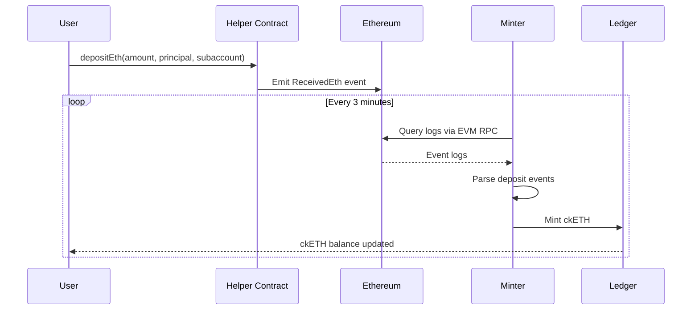

The Internet Computer provides native integration with the Ethereum network, enabling canisters to interact with Ethereum smart contracts, query blockchain state, and manage ETH and ERC-20 tokens through chain-key ECDSA signatures.

## Architecture Overview

The Ethereum integration leverages the IC's HTTP outcalls feature to communicate with Ethereum JSON-RPC providers:

- **EVM RPC Canister**: Provides reliable Ethereum JSON-RPC access via multiple providers
- **Chain-Key ECDSA**: Enables canisters to sign Ethereum transactions
- **ckETH Minter**: Converts ETH to ckETH and vice versa
- **Ledger Suite Orchestrator**: Manages ckERC20 token ledgers

## EVM RPC Integration

<Info>
The Ethereum integration uses HTTPS outcalls to query multiple JSON-RPC providers, achieving decentralization without running full Ethereum nodes.
</Info>

### Key Capabilities

<CardGroup cols={2}>
  <Card title="Smart Contract Calls" icon="file-contract">
    Query and call Ethereum smart contracts
  </Card>
  <Card title="Block Data" icon="cubes">
    Fetch blocks, transactions, and receipts
  </Card>
  <Card title="Event Logs" icon="list">
    Scrape and process Ethereum event logs
  </Card>
  <Card title="Transaction Submission" icon="paper-plane">
    Submit signed transactions to the network
  </Card>
</CardGroup>

### RPC Provider Configuration

The EVM RPC canister aggregates responses from multiple providers:

```rust
// From rs/ethereum/cketh/minter/src/lib.rs
pub const EVM_RPC_ID_PRODUCTION: Principal =
    Principal::from_slice(&[0, 0, 0, 0, 2, 48, 0, 204, 1, 1]);
pub const EVM_RPC_ID_STAGING: Principal = 
    Principal::from_slice(&[0, 0, 0, 0, 2, 48, 0, 161, 1, 1]);
```

The minter uses the EVM RPC canister to:
- Query Ethereum block heights
- Fetch event logs from helper contracts
- Estimate gas fees for transactions
- Submit signed withdrawal transactions

## Chain-Key ECDSA for Ethereum

Canisters can control Ethereum addresses through chain-key ECDSA signatures.

### ECDSA Key Management

<Steps>
  <Step title="Key Derivation">
    Each canister derives unique Ethereum addresses from a subnet ECDSA key:
    
    ```rust
    pub const MAIN_DERIVATION_PATH: Vec<ByteBuf> = vec![];
    ```
  </Step>
  <Step title="Address Generation">
    The public key is converted to an Ethereum address using Keccak-256 hashing.
  </Step>
  <Step title="Transaction Signing">
    Canisters request threshold ECDSA signatures for Ethereum transactions.
  </Step>
</Steps>

### Signing Ethereum Transactions

Canisters can sign EIP-1559 transactions:

```rust
// Transaction structure for Ethereum
struct Eip1559Transaction {
    chain_id: u64,
    nonce: u64,
    max_priority_fee_per_gas: u128,
    max_fee_per_gas: u128,
    gas_limit: u64,
    to: [u8; 20],
    value: u128,
    data: Vec<u8>,
}
```

<Accordion title="EIP-1559 Transaction Fields">
- **chain_id**: Ethereum network identifier (1 for mainnet, 11155111 for Sepolia)
- **nonce**: Transaction sequence number for the sender
- **max_priority_fee_per_gas**: Tip paid to miners (priority fee)
- **max_fee_per_gas**: Maximum total fee willing to pay per gas
- **gas_limit**: Maximum gas units the transaction can consume
- **to**: Destination Ethereum address
- **value**: Amount of ETH to transfer (in wei)
- **data**: Contract call data or empty for simple transfers
</Accordion>

## Ethereum Network Support

### Supported Networks

```rust
// From rs/ethereum/cketh/minter/cketh_minter.did
type EthereumNetwork = variant {
    Mainnet;   // Ethereum mainnet
    Sepolia;   // Sepolia testnet
};
```

| Network | Chain ID | Purpose |
|---------|----------|----------|
| **Mainnet** | 1 | Production Ethereum transactions |
| **Sepolia** | 11155111 | Testing with Sepolia testnet ETH |

<Note>
Sepolia replaced Goerli as the primary Ethereum testnet. Use Sepolia for testing ckETH integration.
</Note>

## Helper Smart Contracts

The Ethereum integration uses helper smart contracts to facilitate deposits and event tracking.

### ETH Helper Contract

The helper contract emits events when users deposit ETH:

```solidity
// Deposit ETH with IC principal and subaccount
function depositEth(
    uint256 amount,
    bytes32 principal,
    bytes32 subaccount
) external payable;
```

### Contract Addresses

<Tabs>
  <Tab title="Mainnet">
    **ETH Helper Contract**: `0x18901044688D3756C35Ed2b36D93e6a5B8e00E68`
    
    [View on Etherscan](https://etherscan.io/address/0x18901044688D3756C35Ed2b36D93e6a5B8e00E68)
  </Tab>
  <Tab title="Sepolia">
    **ETH Helper Contract**: `0x2D39863d30716aaf2B7fFFd85Dd03Dda2BFC2E38`
    
    [View on Sepolia Etherscan](https://sepolia.etherscan.io/address/0x2D39863d30716aaf2B7fFFd85Dd03Dda2BFC2E38)
  </Tab>
</Tabs>

## Event Log Scraping

The ckETH minter continuously scrapes Ethereum event logs to detect deposits.

### Scraping Configuration

```rust
// From rs/ethereum/cketh/minter/src/lib.rs
pub const SCRAPING_ETH_LOGS_INTERVAL: Duration = Duration::from_secs(3 * 60);
pub const PROCESS_ETH_RETRIEVE_TRANSACTIONS_INTERVAL: Duration = 
    Duration::from_secs(6 * 60);
```

### Log Processing Flow



### Event Log Structure

The helper contract emits structured events:

```rust
// Parsed from Ethereum logs
struct ReceivedEthEvent {
    from: [u8; 20],           // Ethereum sender address
    value: u128,              // Amount in wei
    principal: [u8; 29],      // IC principal
    subaccount: [u8; 32],     // IC subaccount
}
```

## Gas Fee Estimation

The minter estimates gas fees for Ethereum transactions using EIP-1559 pricing.

### Fee Structure

```rust
// From rs/ethereum/cketh/minter/cketh_minter.did
type Eip1559TransactionPrice = record {
    gas_limit : nat;
    max_fee_per_gas : nat;
    max_priority_fee_per_gas : nat;
    max_transaction_fee : nat;
    timestamp : opt nat64;
};
```

<Info>
The minter queries multiple RPC providers to get reliable gas fee estimates and uses conservative values to ensure transaction inclusion.
</Info>

### Gas Limit by Operation

| Operation | Typical Gas Limit |
|-----------|------------------|
| ETH Transfer | 21,000 |
| ERC-20 Transfer | ~65,000 |
| Contract Interaction | Variable |
| Helper Contract Deposit | ~33,000 |

## Transaction Management

The minter manages Ethereum transaction lifecycle:

### Transaction States

<Steps>
  <Step title="Pending">
    Withdrawal request received, awaiting transaction creation
  </Step>
  <Step title="TxCreated">
    Transaction created but not yet signed
  </Step>
  <Step title="Signing">
    Requesting threshold ECDSA signature
  </Step>
  <Step title="TxSent">
    Transaction broadcast to Ethereum network
  </Step>
  <Step title="TxFinalized">
    Transaction confirmed on Ethereum blockchain
  </Step>
</Steps>

### Nonce Management

```rust
// From rs/ethereum/cketh/minter/cketh_minter.did
type InitArg = record {
    // ... other fields
    next_transaction_nonce : nat;
};
```

The minter tracks transaction nonces to ensure proper ordering:
- Maintains sequential nonce for all outgoing transactions
- Handles nonce gaps through transaction resubmission
- Supports manual nonce override via upgrade args

## Block Height Tracking

### Block Tags

```rust
type BlockTag = variant {
    Latest;     // Latest mined block
    Safe;       // Latest safe head block  
    Finalized;  // Latest finalized block
};
```

<Accordion title="Block Tag Selection">
- **Latest**: Most recent block, may be reorganized
- **Safe**: Safe from short-term reorganizations (recommended)
- **Finalized**: Fully finalized, safest but may lag behind

The minter uses the configured block tag to determine which blocks to scrape for events.
</Accordion>

## Security Considerations

<Warning>
The Ethereum integration implements multiple security measures:
</Warning>

### Event Validation

- Verify event source (helper contract address)
- Validate principal and subaccount format
- Check minimum deposit amounts
- Confirm transaction finality before minting

### Transaction Security

- All transactions signed via threshold ECDSA
- Gas price limits to prevent overpaying
- Transaction replay protection via nonces
- Failed transaction reimbursement

### RPC Provider Security

- Query multiple providers for consensus
- Detect and handle inconsistent responses
- Automatic fallback to alternative providers
- Rate limiting and retry logic

## Performance Optimizations

### Parallel Processing

The minter processes deposits and withdrawals in parallel:

```rust
// Concurrent timers
pub const SCRAPING_ETH_LOGS_INTERVAL: Duration = Duration::from_secs(3 * 60);
pub const PROCESS_ETH_RETRIEVE_TRANSACTIONS_INTERVAL: Duration = 
    Duration::from_secs(6 * 60);
pub const PROCESS_REIMBURSEMENT: Duration = Duration::from_secs(3 * 60);
```

### Caching Strategy

- Cache recent block data to reduce RPC calls
- Store processed event logs to avoid reprocessing
- Maintain gas fee estimates between updates

## Related Components

<CardGroup cols={2}>
  <Card title="ckETH Minter" icon="coins" href="/chain-integration/cketh">
    Chain-key Ethereum token implementation
  </Card>
  <Card title="ckBTC Minter" icon="coins" href="/chain-integration/ckbtc">
    Chain-key Bitcoin token implementation
  </Card>
</CardGroup>

## Source Code Reference

Key files in the Ethereum integration:

- `rs/ethereum/cketh/minter/src/lib.rs` - Main minter constants and modules
- `rs/ethereum/cketh/minter/src/eth_rpc.rs` - Ethereum RPC abstractions
- `rs/ethereum/cketh/minter/src/eth_rpc_client.rs` - RPC client implementation
- `rs/ethereum/cketh/minter/src/eth_logs/` - Event log parsing
- `rs/ethereum/cketh/minter/src/deposit.rs` - Deposit processing
- `rs/ethereum/cketh/minter/src/withdraw.rs` - Withdrawal handling
- `rs/ethereum/cketh/minter/src/tx.rs` - Transaction management
