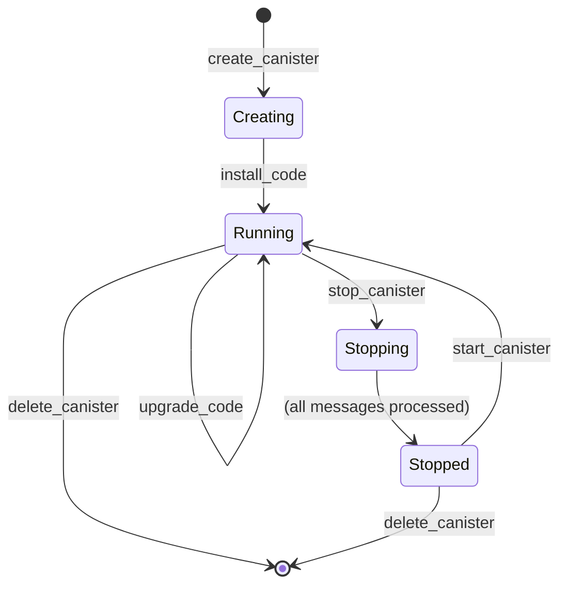

Canisters are the smart contracts of the Internet Computer. They combine code (WebAssembly) and state, running in a secure, isolated environment with the ability to respond to messages, store data persistently, and interact with other canisters and external systems.

## What is a Canister?

A canister is an evolved form of a smart contract with several key characteristics:

<CardGroup cols={2}>
  <Card title="WebAssembly Execution" icon="microchip">
    Runs compiled WebAssembly code for high performance
  </Card>
  <Card title="Persistent State" icon="database">
    Maintains state across executions with automatic persistence
  </Card>
  <Card title="Isolated Execution" icon="shield">
    Runs in sandboxed environment for security
  </Card>
  <Card title="Cycles-Powered" icon="coins">
    Uses cycles for computation and storage costs
  </Card>
</CardGroup>

<Info>
The canister execution environment is implemented in `rs/execution_environment/` and provides the runtime for all canister operations.
</Info>

## Canister Lifecycle

### States and Transitions

A canister progresses through several states during its lifetime:



<Tabs>
  <Tab title="Running">
    The canister is active and can:
    - Process incoming messages
    - Execute scheduled tasks
    - Send outgoing messages
    - Access its persistent state
    - Consume cycles for operations
  </Tab>
  <Tab title="Stopping">
    Transitional state when stop_canister is called:
    - Processes existing messages
    - Rejects new incoming messages
    - Completes outstanding callbacks
    - Transitions to Stopped when queue is empty
  </Tab>
  <Tab title="Stopped">
    The canister is paused:
    - Cannot process new messages
    - Maintains its state
    - Can be restarted or deleted
    - Still incurs storage costs
  </Tab>
</Tabs>

### Lifecycle Management

<Steps>
  <Step title="Creation">
    Create a new canister with `create_canister`:
    ```rust
    // From rs/execution_environment/src/execution_environment.rs
    // Creates canister with unique ID and initial cycles
    ```
  </Step>
  <Step title="Installation">
    Install WebAssembly code with `install_code`:
    ```rust
    // Modes: install, reinstall, upgrade
    // - install: First time code installation
    // - reinstall: Replace code and reset state
    // - upgrade: Replace code while preserving state
    ```
  </Step>
  <Step title="Execution">
    Canister processes messages and executes tasks:
    ```rust
    // Update calls: Modify state
    // Query calls: Read-only, fast responses
    // Heartbeats: Periodic scheduled execution
    ```
  </Step>
  <Step title="Upgrade">
    Upgrade to new code version while preserving state:
    ```rust
    // Pre-upgrade hook: Serialize state
    // Install new code
    // Post-upgrade hook: Deserialize state
    ```
  </Step>
  <Step title="Deletion">
    Remove the canister with `delete_canister`:
    ```rust
    // Canister must be stopped first
    // Remaining cycles returned to controller
    ```
  </Step>
</Steps>

## Canister Types

### Application Canisters

User-deployed canisters that implement dapp logic:

**Characteristics:**
- Created by users or other canisters
- Controlled by principals (users or other canisters)
- Subject to cycles consumption
- Can be upgraded by controllers
- Implement arbitrary business logic

**Example Use Cases:**
- DeFi protocols
- Social networks
- DAOs and governance systems
- Gaming applications
- Data storage services

### System Canisters

Special canisters that provide core IC functionality:

<CardGroup cols={2}>
  <Card title="NNS Canisters" icon="network-wired">
    Governance, Registry, Ledger, Root, and other NNS components
  </Card>
  <Card title="Management Canister" icon="wrench">
    Virtual canister (ic00) for administrative operations
  </Card>
  <Card title="SNS Canisters" icon="users">
    Service Nervous System components for dapp governance
  </Card>
  <Card title="System Subnet Canisters" icon="server">
    Specialized canisters on system subnets (Cycles Minting, etc.)
  </Card>
</CardGroup>

**Key Differences:**
- Often have privileged operations
- May have special cycle charging rules
- Cannot always be upgraded through normal means
- Integrated with IC protocol

## Execution Model

### Message Processing

Canisters respond to different types of messages:

<Accordion title="Update Calls">
Modify canister state and are committed to blockchain:

```rust
// From rs/execution_environment/src/execution/call_or_task.rs
// - Process through consensus
// - Can modify state
// - Generate replies
// - Trigger inter-canister calls
```

**Properties:**
- 2-4 second latency (consensus delay)
- Certified responses
- Consumes cycles
- Can call other canisters
</Accordion>

<Accordion title="Query Calls">
Read-only operations that don't modify state:

```rust
// From rs/execution_environment/src/query_handler/
// - Bypass consensus
// - Read-only access to state
// - Fast responses (~200ms)
// - Lower cost
```

**Properties:**
- Sub-second latency
- No state changes committed
- Lower cycle cost
- Cannot call other canisters
</Accordion>

<Accordion title="Inter-Canister Calls">
Asynchronous calls between canisters:

```rust
// Caller makes async call
// Callee processes and responds
// Caller receives callback
// State changes committed at each step
```

**Properties:**
- Asynchronous execution model
- Multiple round trips possible
- Each step goes through consensus
- Cycles transferred for computation
</Accordion>

<Accordion title="Heartbeats and Timers">
Scheduled periodic execution:

```rust
// Heartbeat: Called every subnet round
// Timer: Called at specified intervals
// No external trigger needed
```

**Properties:**
- Automatic invocation
- Useful for maintenance tasks
- Consumes cycles on each execution
- Must complete within instruction limits
</Accordion>

### Execution Limits

Canisters operate within defined resource limits:

<table>
  <thead>
    <tr>
      <th>Resource</th>
      <th>Limit</th>
      <th>Purpose</th>
    </tr>
  </thead>
  <tbody>
    <tr>
      <td>**Instructions**</td>
      <td>~5-20 billion per message</td>
      <td>Prevent infinite loops and DoS</td>
    </tr>
    <tr>
      <td>**Message Size**</td>
      <td>2 MB</td>
      <td>Limit network bandwidth usage</td>
    </tr>
    <tr>
      <td>**Wasm Memory**</td>
      <td>4 GB (32-bit) or more (64-bit)</td>
      <td>Canister heap space</td>
    </tr>
    <tr>
      <td>**Stable Memory**</td>
      <td>Up to 400 GB</td>
      <td>Persistent storage across upgrades</td>
    </tr>
    <tr>
      <td>**Call Stack**</td>
      <td>500 levels</td>
      <td>Prevent deep recursion</td>
    </tr>
  </tbody>
</table>

<Warning>
Exceeding execution limits will cause message execution to fail and state changes to be rolled back.
</Warning>

## Sandboxed Execution

Canisters run in isolated sandboxes for security:

```
Replica Process
├── Execution Environment
│   ├── Canister Sandbox Manager (rs/canister_sandbox/)
│   │   ├── Sandbox Process 1 (Canister A)
│   │   ├── Sandbox Process 2 (Canister B)
│   │   └── Sandbox Process N (Canister N)
│   └── Message Routing
└── State Manager
```

**Sandbox Features:**

<CardGroup cols={2}>
  <Card title="Process Isolation" icon="lock">
    Each canister runs in a separate OS process
  </Card>
  <Card title="Memory Protection" icon="shield-halved">
    Canisters cannot access each other's memory
  </Card>
  <Card title="Resource Limits" icon="gauge">
    CPU and memory limits enforced by OS
  </Card>
  <Card title="Syscall Filtering" icon="filter">
    Restricted system call access via seccomp
  </Card>
</CardGroup>

<CodeGroup>
```rust Sandbox Implementation
// rs/canister_sandbox/src/replica_controller/
// - sandboxed_execution_controller.rs: Manages sandboxes
// - sandbox_process_eviction.rs: Process lifecycle
// - launch_as_process.rs: Sandbox process creation
```
</CodeGroup>

## State Management

### Wasm Memory

Canister heap memory (volatile):

```rust
// Automatically saved/restored during upgrades
// Limited by WebAssembly memory constraints
// Fast access for active data
```

### Stable Memory

Persistent storage across upgrades:

```rust
// Explicitly managed by canister code
// Survives code upgrades
// Up to 400 GB capacity
// Uses stable_read/stable_write System API
```

**Upgrade Pattern:**

<Steps>
  <Step title="Pre-Upgrade Hook">
    Serialize important state to stable memory:
    ```rust
    #[pre_upgrade]
    fn pre_upgrade() {
        // Save state to stable memory
        let state = get_state();
        stable_write(0, &serialize(state));
    }
    ```
  </Step>
  <Step title="Code Replacement">
    New WebAssembly code is installed
  </Step>
  <Step title="Post-Upgrade Hook">
    Deserialize state from stable memory:
    ```rust
    #[post_upgrade]
    fn post_upgrade() {
        // Restore state from stable memory
        let bytes = stable_read(0, size);
        set_state(deserialize(&bytes));
    }
    ```
  </Step>
</Steps>

<Tip>
Use stable memory for data that must persist across upgrades. Wasm memory is faster but is reset on reinstall.
</Tip>

## Cycles and Resource Costs

Canisters pay for resources using cycles:

**Cost Factors:**
- **Computation**: Instructions executed
- **Storage**: Bytes stored over time
- **Network**: Message sizes
- **Special Operations**: HTTPS outcalls, threshold signatures, etc.

**Cycle Management:**

```rust
// Check canister balance
canister_balance() -> u64

// Accept cycles from caller
msg_cycles_accept(amount) -> u64

// Send cycles with call
call_with_cycles(canister_id, method, args, cycles)
```

<Warning>
If a canister runs out of cycles, it will be uninstalled and its state will be deleted. Monitor cycle balances carefully.
</Warning>

## System API

Canisters interact with the IC through the System API:

<AccordionGroup>
  <Accordion title="Message Inspection">
    ```rust
    msg_caller() -> Principal       // Caller's principal
    msg_arg_data_size() -> u32     // Argument size
    msg_arg_data_copy()            // Read arguments
    msg_reply()                    // Send reply
    msg_reject()                   // Reject call
    ```
  </Accordion>
  
  <Accordion title="Canister Management">
    ```rust
    canister_cycle_balance() -> u64        // Current balance
    canister_status() -> CanisterStatus    // Running/Stopped/etc
    canister_version() -> u64              // Upgrade version
    ```
  </Accordion>
  
  <Accordion title="Inter-Canister Calls">
    ```rust
    call_new()                     // Initialize call
    call_data_append()             // Add arguments
    call_cycles_add()              // Attach cycles
    call_perform()                 // Execute call
    ```
  </Accordion>
  
  <Accordion title="Time and Randomness">
    ```rust
    time() -> u64                  // Current time (nanoseconds)
    performance_counter() -> u64    // Performance metric
    global_timer_set() -> u64      // Schedule timer
    ```
  </Accordion>
  
  <Accordion title="Storage">
    ```rust
    stable_size() -> u64           // Stable memory pages
    stable_grow(pages) -> i64      // Allocate pages
    stable_read(offset, size)      // Read from stable memory
    stable_write(offset, data)     // Write to stable memory
    stable64_*()                   // 64-bit stable memory API
    ```
  </Accordion>
</AccordionGroup>

## Best Practices

<CardGroup cols={2}>
  <Card title="Design for Upgrades" icon="arrow-up">
    - Use stable memory for critical state
    - Implement pre/post upgrade hooks
    - Version your data structures
    - Test upgrade paths thoroughly
  </Card>
  
  <Card title="Manage Resources" icon="gauge">
    - Monitor cycle balance
    - Set up cycle top-up mechanisms
    - Optimize instruction usage
    - Use query calls when possible
  </Card>
  
  <Card title="Handle Errors" icon="triangle-exclamation">
    - Check return values from System API
    - Handle inter-canister call failures
    - Implement retry logic
    - Validate input data
  </Card>
  
  <Card title="Security First" icon="lock">
    - Validate all inputs
    - Check caller identity
    - Use access control
    - Audit upgrade permissions
  </Card>
</CardGroup>

## Source Code Reference

<CodeGroup>
```rust Execution Environment
// rs/execution_environment/src/
// - execution_environment.rs: Core execution logic
// - hypervisor.rs: WebAssembly execution
// - scheduler.rs: Message scheduling
// - canister_manager.rs: Lifecycle management
```

```rust Sandbox
// rs/canister_sandbox/src/
// - replica_controller/: Sandbox orchestration
// - sandbox_service.rs: Sandbox process logic
// - protocol/: Communication protocols
```
</CodeGroup>

**Key Files:**
- `rs/execution_environment/src/execution_environment.rs`: Main execution logic
- `rs/execution_environment/src/hypervisor.rs`: Wasm execution and System API
- `rs/canister_sandbox/src/replica_controller/`: Sandbox management
- `rs/replicated_state/src/canister_state/`: Canister state structures

## Related Topics

<CardGroup cols={2}>
  <Card title="State Management" href="/core/state-management">
    Learn about state synchronization and persistence
  </Card>
  <Card title="Network Nervous System" href="/core/nns">
    Understand IC governance and system canisters
  </Card>
  <Card title="Cryptography" href="/core/crypto">
    Explore IC's cryptographic features
  </Card>
  <Card title="Service Nervous System" href="/core/sns">
    Build decentralized dapp governance
  </Card>
</CardGroup>