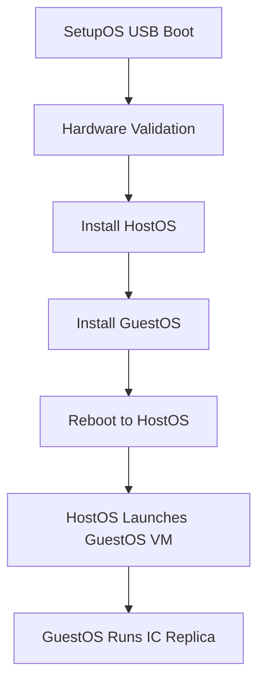

## What is IC-OS?

IC-OS is an umbrella term for all the operating systems within the Internet Computer, including SetupOS, HostOS, and GuestOS. These three specialized operating systems work together to provide a secure, isolated, and upgradeable environment for running IC replica nodes.

Each operating system serves a distinct purpose in the node lifecycle:

<CardGroup cols={3}>
  <Card title="SetupOS" icon="download" href="/ic-os/setupos">
    Boots new replica nodes and installs HostOS and GuestOS
  </Card>
  <Card title="HostOS" icon="server" href="/ic-os/hostos">
    Runs on the host machine and launches GuestOS in a virtual machine
  </Card>
  <Card title="GuestOS" icon="microchip" href="/ic-os/guestos">
    Runs inside a VM and executes the core IC protocol
  </Card>
</CardGroup>

## The Three Operating Systems

### SetupOS

SetupOS is responsible for the initial node deployment process. When a Node Provider receives new hardware, they:

1. Download the SetupOS image onto a bootable USB drive
2. Add necessary configuration to the image
3. Boot the node from the USB drive

SetupOS then performs hardware validation, prepares components, and installs both HostOS and GuestOS onto the node's storage. Once complete, the machine reboots into HostOS.

### HostOS

HostOS is the operating system running directly on the host machine hardware. Its primary responsibility is to launch and manage the GuestOS virtual machine using QEMU/libvirt.

**Key characteristics:**
- Intentionally limited in capabilities by design
- Does not perform any trusted IC protocol operations
- Provides secure isolation for the GuestOS
- Manages virtual machine lifecycle

### GuestOS

GuestOS runs inside a QEMU virtual machine on top of HostOS. This is where the actual Internet Computer protocol execution occurs.

**Key characteristics:**
- Contains the replica and orchestrator binaries
- Executes all IC protocol operations
- Runs in a virtualized, isolated environment
- Ensures consistent runtime across different hardware platforms

## How They Work Together

The three operating systems form a secure, layered architecture:

### Deployment Flow

1. **Initial Setup**: SetupOS boots from USB and validates hardware
2. **Installation**: SetupOS installs both HostOS and GuestOS to disk
3. **First Boot**: Machine reboots into HostOS
4. **VM Launch**: HostOS starts the GuestOS virtual machine
5. **Protocol Execution**: GuestOS runs the IC replica and joins the network

### Security Through Isolation

The virtualization layer provides several security benefits:

- **Isolation**: GuestOS runs in a VM, isolated from the host hardware
- **Limited Attack Surface**: HostOS has minimal capabilities and services
- **Secure Communication**: VM sockets (VSOCK) provide controlled communication between GuestOS and HostOS
- **Hardware Independence**: Virtual machine ensures consistent execution environment

## Upgrade Architecture

Both HostOS and GuestOS use an A/B partition scheme that enables upgrades without downtime:

<Info>
The A/B partition layout allows one partition set to run the system while the other is upgraded, then the system switches to the newly upgraded partition on the next boot.
</Info>

### Partition Structure

Each OS maintains:
- **Boot A/B**: Separate boot partitions for each system version
- **Root A/B**: Separate root filesystems for each system version
- **Var A/B**: Separate mutable data partitions for each system version
- **Config**: Shared configuration partition preserved across upgrades

## Ubuntu Foundation

All three IC-OS variants are based on Ubuntu:

- Built from minimal Ubuntu Docker images
- Only required packages and services included
- Reproducible build process using Bazel
- Weekly base image updates for security patches

<Note>
The minimal, controlled approach to system assembly is key for maintaining a secure platform. Rather than using full upstream ISO images, the system is assembled from well-understood components.
</Note>

## Build System

IC-OS images are built using a sophisticated process:

1. **Docker Build**: System assembled as Docker image first
2. **Image Transformation**: Docker image converted to bootable disk images
3. **Binary Injection**: IC services and binaries added late in the build
4. **Bazel Orchestration**: All builds managed through Bazel

For detailed build instructions, see the [Building IC-OS](/ic-os/building) guide.

## Next Steps

<CardGroup cols={2}>
  <Card title="Build IC-OS Images" icon="hammer" href="/ic-os/building">
    Learn how to build IC-OS images locally using Bazel
  </Card>
  <Card title="GuestOS Details" icon="book" href="/ic-os/guestos">
    Deep dive into the GuestOS architecture and components
  </Card>
  <Card title="HostOS Details" icon="book" href="/ic-os/hostos">
    Understand HostOS responsibilities and limitations
  </Card>
  <Card title="SetupOS Details" icon="book" href="/ic-os/setupos">
    Learn about the node setup and installation process
  </Card>
</CardGroup>
