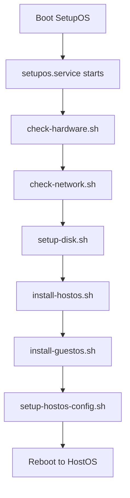

## Introduction

SetupOS is an operating system designed specifically for installing both HostOS and GuestOS onto new Internet Computer nodes. It enables Node Providers to independently onboard their nodes without external assistance.

<Info>
SetupOS runs from a bootable USB drive and performs hardware validation, system preparation, and installation of both operating systems.
</Info>

## Purpose

SetupOS serves as the bootstrapping mechanism for IC nodes:

<CardGroup cols={2}>
  <Card title="Hardware Validation" icon="check-circle">
    Verifies system hardware meets IC requirements
  </Card>
  <Card title="Network Verification" icon="network-wired">
    Tests connectivity and NNS reachability
  </Card>
  <Card title="Disk Preparation" icon="hard-drive">
    Prepares storage with proper partitioning
  </Card>
  <Card title="OS Installation" icon="download">
    Installs HostOS and GuestOS to disk
  </Card>
</CardGroup>

## Installation Process

Node Providers follow these steps to onboard a new node:

<Steps>
  <Step title="Obtain SetupOS Image">
    Download the SetupOS image from the official source
  </Step>
  
  <Step title="Prepare USB Drive">
    Write the SetupOS image to a bootable USB drive:
    ```bash
    dd if=setupos.img of=/dev/sdX bs=4M status=progress
    sync
    ```
  </Step>
  
  <Step title="Add Configuration">
    Mount the USB drive and add necessary configuration files:
    - `config.ini`: Network and node settings
    - `node_operator_private_key.pem`: Node operator credentials
    - Other bootstrap configuration
  </Step>
  
  <Step title="Boot from USB">
    Plug the USB drive into the node machine and configure BIOS/UEFI to boot from USB
  </Step>
  
  <Step title="Automatic Installation">
    SetupOS boots and automatically:
    - Validates hardware
    - Checks network connectivity
    - Prepares disk storage
    - Installs HostOS
    - Installs GuestOS
    - Configures the system
  </Step>
  
  <Step title="Reboot to HostOS">
    Once complete, the machine automatically reboots into HostOS, which then launches GuestOS
  </Step>
</Steps>

<Warning>
The installation process will erase all data on the target disk. Ensure you have backed up any important data before starting.
</Warning>

## Hardware Requirements

For detailed hardware and networking requirements, visit the [Node Provider Onboarding Wiki](https://wiki.internetcomputer.org/wiki/Node_Provider_Onboarding).

### Minimum Requirements

- **CPU**: x86-64 with virtualization support (Intel VT-x or AMD-V)
- **Memory**: Sufficient RAM for both HostOS and GuestOS
- **Storage**: SSD with adequate space for dual-boot partitions
- **Network**: IPv6 connectivity to the Internet Computer network

## Under the Hood

SetupOS uses a systemd-based installation process:

### Installation Service

The installation is initiated by the systemd service unit file `setupos.service`:

- **Service Type**: `idle` (starts after all other units)
- **Purpose**: Ensures system is fully ready before installation
- **Location**: Systemd unit file

### Installation Scripts

The installation process consists of multiple Shell and Python scripts located in `/opt/ic/bin`:

<Steps>
  <Step title="check-hardware.sh">
    **Hardware Verification**
    
    Validates system hardware components:
    - CPU features and capabilities
    - Memory capacity
    - Storage devices
    - Network interfaces
    - Virtualization support
    
    Fails installation if hardware does not meet requirements.
  </Step>
  
  <Step title="check-network.sh">
    **Network Connectivity**
    
    Tests network connectivity:
    - IPv6 configuration
    - Internet connectivity
    - NNS (Network Nervous System) reachability
    - DNS resolution
    
    Ensures the node can communicate with the IC network.
  </Step>
  
  <Step title="setup-disk.sh">
    **Disk Preparation**
    
    Prepares the storage device:
    - Purges existing LVM configurations
    - Removes existing partitions
    - Creates new partition table
    - Sets up partition structure
    
    <Warning>
    This step destroys all existing data on the disk.
    </Warning>
  </Step>
  
  <Step title="install-hostos.sh">
    **HostOS Installation**
    
    Installs and configures HostOS:
    - Writes HostOS image to appropriate partitions
    - Configures bootloader
    - Sets up initial HostOS configuration
    - Prepares for GuestOS VM management
  </Step>
  
  <Step title="install-guestos.sh">
    **GuestOS Installation**
    
    Installs and configures GuestOS:
    - Writes GuestOS image to appropriate partitions
    - Configures VM settings
    - Sets up initial GuestOS configuration
    - Prepares IC runtime environment
  </Step>
  
  <Step title="setup-hostos-config.sh">
    **Configuration Finalization**
    
    Sets up the HostOS config partition:
    - Writes configuration files
    - Sets up encryption keys
    - Configures networking
    - Prepares bootstrap data
  </Step>
</Steps>

### Script Execution Flow

The main installation script `setupos.sh` orchestrates the execution of all scripts in the correct order, with error handling and logging at each step.



## Node Provider Roles

Understanding the different roles in node management:

<Tabs>
  <Tab title="Node Provider">
    **Entity that owns the hardware**
    
    - Purchases and owns the physical node hardware
    - Receives rewards for the node's useful work
    - Responsible for overall node operation
    - Registers with the Network Nervous System (NNS)
  </Tab>
  
  <Tab title="Node Technician">
    **Individual who manages the hardware**
    
    - Performs physical installation of the node
    - Handles maintenance and repairs
    - Often "hired hands" or "remote hands" employed by Node Providers
    - Can cycle among several parties for a single node
    - Uses Node Operator private key to onboard nodes
    
    <Note>
    A Node Provider and Node Technician can be the same entity.
    </Note>
  </Tab>
  
  <Tab title="Node Operator">
    **Registry record and cryptographic key**
    
    <Warning>
    "Node Operator" does NOT refer to a person, but to:
    - A record in the NNS registry (Node Operator record)
    - A cryptographic key pair (Node Operator key)
    </Warning>
    
    The term has been historically overloaded and sometimes incorrectly used to refer to Node Technicians.
  </Tab>
</Tabs>

## Node Onboarding Flow

The complete process for onboarding nodes:

<Steps>
  <Step title="Create Node Operator Key">
    Node Provider generates a private/public key pair:
    ```bash
    # Generate key pair
    openssl genpkey -algorithm ED25519 -out node_operator_private_key.pem
    openssl pkey -in node_operator_private_key.pem -pubout -out node_operator_public_key.pem
    ```
  </Step>
  
  <Step title="Create Node Operator Record">
    Node Provider creates a Node Operator record in the NNS containing:
    - Node Operator public key
    - Node Provider identity
    - Node allowance
    - Other metadata
    
    See [node_operator.proto](file:///home/daytona/workspace/source/rs/protobuf/def/registry/node_operator/v1/node_operator.proto) for details.
  </Step>
  
  <Step title="Share Private Key">
    Node Provider shares the Node Operator private key with their Node Technician, enabling the technician to onboard nodes on behalf of the Node Provider.
  </Step>
  
  <Step title="NNS Verification">
    Before approving onboarding, the NNS verifies:
    - Node Operator record exists and is valid
    - Node Provider is authorized to onboard nodes
    - Node Provider has not exceeded their node allotment
    - Cryptographic signature is valid
  </Step>
  
  <Step title="Node Registration">
    Upon successful verification, the node is registered in the IC registry and can join the network.
  </Step>
</Steps>

## Configuration Files

SetupOS requires specific configuration files on the USB drive:

### config.ini

Main configuration file containing:

```ini
[network]
ipv6_prefix = 2001:db8::/64
ipv6_gateway = 2001:db8::1

[node]
hostname = node-1234
domain = example.com

[nns]
registry_url = https://nns.ic0.app
```

### Node Operator Private Key

The private key file (`node_operator_private_key.pem`) used for:
- Authenticating with the NNS
- Signing node registration requests
- Proving authorization to onboard nodes

<Warning>
Keep the Node Operator private key secure. Anyone with access to this key can onboard nodes under your Node Provider identity.
</Warning>

### Bootstrap Package

Optional `ic-bootstrap.tar` containing:
- Initial IC configuration
- SSH authorized keys
- Network settings
- Custom configuration

## Troubleshooting

### Installation Failures

<AccordionGroup>
  <Accordion title="Hardware validation fails">
    **Common causes:**
    - CPU lacks virtualization support
    - Insufficient memory
    - Storage device too small
    - Missing network interfaces
    
    **Solution:** Verify hardware meets minimum requirements
  </Accordion>
  
  <Accordion title="Network check fails">
    **Common causes:**
    - No IPv6 connectivity
    - Firewall blocking NNS access
    - DNS resolution issues
    - Network misconfiguration
    
    **Solution:** Verify network configuration and connectivity
  </Accordion>
  
  <Accordion title="Installation hangs">
    **Common causes:**
    - Slow storage device
    - Hardware issues
    - Corrupted image
    
    **Solution:** Check console output for errors, verify USB drive integrity
  </Accordion>
  
  <Accordion title="Node doesn't register with NNS">
    **Common causes:**
    - Incorrect Node Operator private key
    - Node allowance exceeded
    - Invalid configuration
    - Network issues
    
    **Solution:** Verify Node Operator credentials and NNS reachability
  </Accordion>
</AccordionGroup>

### Viewing Installation Logs

SetupOS logs are available through systemd:

```bash
# View installation service logs
journalctl -u setupos.service

# View all logs
journalctl -b

# Follow logs in real-time
journalctl -u setupos.service -f
```

### Manual Intervention

If automatic installation fails, you can access the SetupOS system:

<Info>
For development images, the root account is enabled with username and password both set to `root`.
</Info>

```bash
# Access console
# Login as root

# Check script status
cd /opt/ic/bin
ls -la

# Run scripts manually
./check-hardware.sh
./check-network.sh
```

## Building SetupOS

To build a SetupOS image, refer to the [Building IC-OS](/ic-os/building) guide.

<Tip>
SetupOS has both `prod` and `dev` build targets. Use `dev` for testing and debugging, `prod` for actual node deployments.
</Tip>

## Next Steps

<CardGroup cols={2}>
  <Card title="Build SetupOS" icon="hammer" href="/ic-os/building">
    Learn how to build SetupOS images
  </Card>
  <Card title="HostOS" icon="server" href="/ic-os/hostos">
    Understand what happens after installation
  </Card>
  <Card title="Node Provider Onboarding" icon="book" href="https://wiki.internetcomputer.org/wiki/Node_Provider_Onboarding">
    Complete onboarding documentation
  </Card>
  <Card title="IC-OS Overview" icon="home" href="/ic-os/overview">
    Return to IC-OS overview
  </Card>
</CardGroup>
